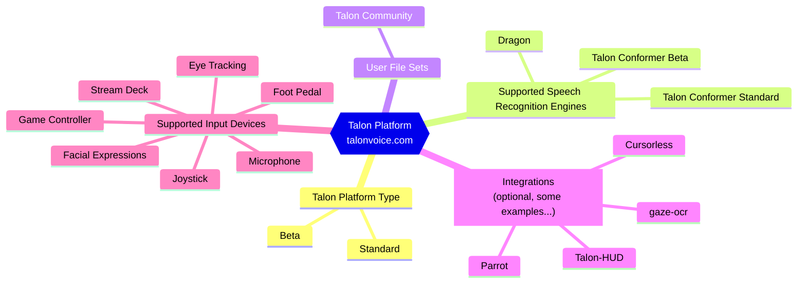

Directory structure:
└── taloncommunity-wiki/
    ├── CODE_OF_CONDUCT.md
    ├── docs/
    │   ├── Basic Usage/
    │   │   ├── basic_usage.md
    │   │   └── settings.md
    │   ├── Customization/
    │   │   ├── basic_customization.md
    │   │   ├── misc-tips.md
    │   │   ├── talon-files.md
    │   │   ├── talon_lists.md
    │   │   ├── Examples/
    │   │   │   ├── canvas.md
    │   │   │   ├── push_to_talk.md
    │   │   │   ├── simple.md
    │   │   │   ├── toggle_listening.md
    │   │   │   └── turn_off_listening.md
    │   │   ├── Talon Framework/
    │   │   │   ├── _category_.yml
    │   │   │   ├── actions.md
    │   │   │   ├── apps.md
    │   │   │   ├── captures.md
    │   │   │   ├── lists.md
    │   │   │   ├── modes.md
    │   │   │   ├── modules_and_contexts.md
    │   │   │   ├── scopes.md
    │   │   │   ├── settings.md
    │   │   │   ├── tags.md
    │   │   │   └── talon-framework-overview.md
    │   │   └── Talon Library Reference/
    │   │       ├── _category_.yml
    │   │       └── key_action.md
    │   ├── Help/
    │   │   ├── beta_talon.md
    │   │   ├── FAQ.md
    │   │   └── talon-slack.md
    │   ├── Hidden Legacy Pages/
    │   │   └── _category_.yml
    │   ├── Integrations/
    │   │   ├── accessibility.md
    │   │   ├── essential-tools.md
    │   │   ├── other-integrations.md
    │   │   ├── talon_related_resources.md
    │   │   └── talon_user_file_sets.md
    │   └── Resource Hub/
    │       ├── Hardware/
    │       │   ├── _category_.yml
    │       │   ├── hardware.md
    │       │   ├── os.md
    │       │   ├── tobii_4c.md
    │       │   └── tobii_5.md
    │       ├── Speech Recognition/
    │       │   ├── improving_recognition_accuracy.md
    │       │   ├── Running-Linux-or-Mac-Talon-Using-Windows-Dragon.md
    │       │   ├── speech engines.md
    │       │   └── troubleshooting.md
    │       └── Talon Installation/
    │           ├── downloading-community.md
    │           ├── installation_guide.md
    │           └── nix.md
    └── src/
        └── pages/
            ├── index.md
            └── unofficial_talon_docs.md

================================================
FILE: CODE_OF_CONDUCT.md
================================================
# Contributor Covenant Code of Conduct

## Our Pledge

In the interest of fostering an open and welcoming environment, we as
contributors and maintainers pledge to making participation in our project and
our community a harassment-free experience for everyone, regardless of age, body
size, disability, ethnicity, sex characteristics, gender identity and expression,
level of experience, education, socio-economic status, nationality, personal
appearance, race, religion, or sexual identity and orientation.

## Our Standards

Examples of behavior that contributes to creating a positive environment
include:

- Using welcoming and inclusive language
- Being respectful of differing viewpoints and experiences
- Gracefully accepting constructive criticism
- Focusing on what is best for the community
- Showing empathy towards other community members

Examples of unacceptable behavior by participants include:

- The use of sexualized language or imagery and unwelcome sexual attention or
  advances
- Trolling, insulting/derogatory comments, and personal or political attacks
- Public or private harassment
- Publishing others' private information, such as a physical or electronic
  address, without explicit permission
- Other conduct which could reasonably be considered inappropriate in a
  professional setting

## Our Responsibilities

Project maintainers are responsible for clarifying the standards of acceptable
behavior and are expected to take appropriate and fair corrective action in
response to any instances of unacceptable behavior.

Project maintainers have the right and responsibility to remove, edit, or
reject comments, commits, code, wiki edits, issues, and other contributions
that are not aligned to this Code of Conduct, or to ban temporarily or
permanently any contributor for other behaviors that they deem inappropriate,
threatening, offensive, or harmful.

## Scope

This Code of Conduct applies both within project spaces and in public spaces
when an individual is representing the project or its community. Examples of
representing a project or community include using an official project e-mail
address, posting via an official social media account, or acting as an appointed
representative at an online or offline event. Representation of a project may be
further defined and clarified by project maintainers.

## Enforcement

Instances of abusive, harassing, or otherwise unacceptable behavior may be
reported by contacting the project team at community@talon.wiki. All
complaints will be reviewed and investigated and will result in a response that
is deemed necessary and appropriate to the circumstances. The project team is
obligated to maintain confidentiality with regard to the reporter of an incident.
Further details of specific enforcement policies may be posted separately.

Project maintainers who do not follow or enforce the Code of Conduct in good
faith may face temporary or permanent repercussions as determined by other
members of the project's leadership.

## Attribution

This Code of Conduct is adapted from the [Contributor Covenant][homepage], version 1.4,
available at https://www.contributor-covenant.org/version/1/4/code-of-conduct.html

[homepage]: https://www.contributor-covenant.org

For answers to common questions about this code of conduct, see
https://www.contributor-covenant.org/faq


================================================
FILE: docs/Basic Usage/basic_usage.md
================================================
# Basic Usage

The examples below are just a very small selection of common commands for working with Talon. These are based on the [Talon Community](https://github.com/talonhub/community) user file set.

## Mode Switching

Talon has three basic modes by default:

- In **command mode**, your speech will be interpreted as commands by default.
- In **dictation mode**, your speech will be transcribed as plain text by default (although with some commands, like "comma" etc. for punctuation), similar to traditional speech recognition systems.
- In **sleep mode**, Talon will do nothing until it hears a commands that wakes it up.

To keep track of what mode you are in with a visual icon, enable the [mode indicator feature](https://github.com/talonhub/community/tree/main/plugin/mode_indicator) in the community repository.

| Command          | Description                 |
| ---------------- | --------------------------- |
| `wake up`        | Enable speech recognition.  |
| `go to sleep`    | Disable speech recognition. |
| `dictation mode` | Switch to dictation mode.   |
| `command mode`   | Switch to command mode.     |

## Help Commands

| Command                      | Description                                                      |
| ---------------------------- | ---------------------------------------------------------------- |
| `help alphabet`              | show the spelling alphabet for pressing individual keys          |
| `help context`               | show all defined commands                                        |
| `help active`                | show all currently available commands                            |
| `help next`, `help previous` | go to the next or previous page of help items if there are a lot |
| `help close`                 | hide any open help window again                                  |
| `command history`            | show the command history                                         |
| `talon open log`             | open the Talon log for debugging                                 |

## Dictating Text

Say a formatter then the text. (i.e. `say "hello world"`) to dictate while in command mode

| Formatter         | Description                             |
| ----------------- | --------------------------------------- |
| `say`             | no special formatting is applied        |
| `sentence`        | the first word is capitalized           |
| `title`           | every word starts with a capital letter |
| `all down`        | every word is all lower case            |
| `smash`           | no spaces between words                 |
| `kebab`           | dashes instead of spaces                |
| `help formatters` | show all available formatters           |

## Customize Talon

These commands will open up a CSV or [Talon list](Customization/talon_lists.md) file in your default text editor that you can edit to customize voice commands without needing to write Talon scripts.

| Command                      | Description                                       |
| ---------------------------- | ------------------------------------------------- |
| `customize additional words` | add additional words that Talon will recognize    |
| `customize words to replace` | remap or reformat words that Talon will recognize |
| `customize alphabet`         | change the default Talon alphabet                 |
| `customize websites`         | add websites that can be opened with Talon        |

## Working with applications

| Command             | Description                                                       |
| ------------------- | ----------------------------------------------------------------- |
| `focus "app name"`  | say "focus chrome" for example, to switch active window to chrome |
| `running list`      | see all active applications                                       |
| `launch "app name"` | say "launch chrome" for example, to open chrome                   |
| `window close`      | closes the currently active window                                |

## Working with tabs

| Command           |
| ----------------- |
| `tab new`         |
| `tab last`        |
| `tab next`        |
| `tab close`       |
| `tab restore`     |
| `go tab <number>` |
| `go tab final`    |

## Working with media

| Command         |
| --------------- |
| `mute`          |
| `play next`     |
| `play previous` |
| `play`          |

## Controlling the Tobii eye tracker

| Commands          | Description                          |
| ----------------- | ------------------------------------ |
| `run calibration` | start Tobii calibration              |
| `control mouse`   | toggle on/off Tobii moving the mouse |
| `zoom mouse`      | Toggle Control Mouse (Zoom).         |
| `control off`     | Turn the eye tracker off             |

## Working with text

| Command        | Description                                                               |
| -------------- | ------------------------------------------------------------------------- |
| `copy that`    |                                                                           |
| `control cap`  | copy via the keyboard shortcut using the Talon alphabet (`cap` for `c`)   |
| `paste that`   |                                                                           |
| `control vest` | paste via the keyboard shortcut using the Talon alphabet (`vest` for `v`) |
| `cut that`     |                                                                           |
| `undo that`    |                                                                           |
| `redo that`    |                                                                           |
| `scratch that` | undo Talon dictation                                                      |

## Mouse Commands

| Command      | Description                             |
| ------------ | --------------------------------------- |
| `touch`      | single click                            |
| `duke`       | double click                            |
| `trip click` | triple click                            |
| `drag`       | hold down the mouse. Repeat to release  |
| `curse yes`  | hides the mouse cursor for eye tracking |
| `curse no`   | shows the mouse cursor                  |
| `righty`     | right click                             |

## Scrolling

| Command        | Description                            |
| -------------- | -------------------------------------- |
| `page down`    | press the page down key                |
| `page up`      | press the page up key                  |
| `scroll down`  | scroll down                            |
| `scroll up`    | scroll up                              |
| `wheel down`   | scroll down                            |
| `wheel up`     | scroll up                              |
| `wheel left`   | scroll left                            |
| `wheel gaze`   | scroll according to the mouse position |
| `wheel upper`  | continually scroll up                  |
| `wheel downer` | continually scroll down                |
| `wheel stop`   | stop scrolling                         |


================================================
FILE: docs/Basic Usage/settings.md
================================================
# Settings

Talon's behavior can be changed by changing the value of settings within a `.talon` file inside a `settings():` block.

```talon
# Example Talon file
settings():
    # Enable the Talon mode indicator
    user.mode_indicator_show = true
```

:::tip

Talon settings can be applied from any `.talon` file in the user directory, regardless of the filename or location.

:::

:::important

If the same setting is defined multiple times, Talon will use the setting value in the `.talon` file with the most specific context match.

:::

## Community Settings

| Setting                              | Example Value | Description                                                                                                                                             |
| ------------------------------------ | ------------- | ------------------------------------------------------------------------------------------------------------------------------------------------------- |
| user.file_manager_auto_show_pickers  | false         | If `true`, automatically show the picker GUI when the file manager has focus                                                                            |
| user.help_max_command_lines_per_page | 50            | Set the number of command lines to display per help page                                                                                                |
| user.help_max_contexts_per_page      | 20            | Set the number of contexts to display per help page                                                                                                     |
| user.mouse_continuous_scroll_amount  | 80            | Set the scroll amount for continuous scroll/gaze scroll                                                                                                 |
| user.mouse_enable_pop_stops_scroll   | true          | If `true`, stop continuous scroll/gaze scroll with a pop                                                                                                |
| user.mouse_enable_pop_click          | 1             | Choose how pop click should work in 'control mouse' mode (0 = off, 1 = on with eyetracker but not zoom mouse mode, 2 = on but not with zoom mouse mode) |
| user.mouse_enable_hiss_scroll        | false         | If `true`, use a hissing noise to scroll continuously                                                                                                   |
| user.mouse_hide_mouse_gui            | false         | If `true`, hide the continuous scroll/gaze scroll GUI                                                                                                   |
| user.mouse_wake_hides_cursor         | false         | If `true`, hide the cursor when enabling zoom mouse                                                                                                     |
| user.mouse_wheel_down_amount         | 120           | Set the amount to scroll up/down                                                                                                                        |
| user.mouse_wheel_horizontal_amount   | 40            | Set the amount to scroll left/right                                                                                                                     |
| user.grids_put_one_bottom_left       | true          | If `true`, start mouse grid numbering on the bottom left (vs. top left)                                                                                 |
| user.command_history_display         | 10            | Set the default number of command history lines to display                                                                                              |
| user.command_history_size            | 50            | Set the total number of command history lines to display                                                                                                |
| user.mode_indicator_show             | false         | Enable the mode indicator                                                                                                                               |
| user.mode_indicator_x                | 1             | X Position for the mode indicator when it is enabled                                                                                                    |
| user.mode_indicator_y                | 0             | Y Position for the mode indicator when it is enabled                                                                                                    |
| user.listening_timeout_minutes       | 3             | Puts Talon into sleep mode if no commands are spoken for a defined period of time.                                                                      |

## Core Talon Settings

| Setting         | Example Value | Description                                                                                                                                                                                                                                                                                                                                                                                   |
| --------------- | ------------- | --------------------------------------------------------------------------------------------------------------------------------------------------------------------------------------------------------------------------------------------------------------------------------------------------------------------------------------------------------------------------------------------- |
| imgui.scale     | 1.5           | Adjust the scale of the imgui windows                                                                                                                                                                                                                                                                                                                                                         |
| imgui.dark_mode | false         | If `true` enable dark mode for Talon imgui menus (used for help menus in community)                                                                                                                                                                                                                                                                                                           |
| insert_wait     | 0             | Increase this if characters seem to be jumbled in a specific app when typing whole sentences. Default is 0.                                                                                                                                                                                                                                                                                   |
| key_hold        | 16            | Increase this if you're playing a game and some keys aren't registering at all. You should probably increase it in 16ms increments, e.g. set it to 16ms or 32ms.                                                                                                                                                                                                                              |
| key_wait        | 1             | Increase this if modifier keys are getting dropped or if key presses are misbehaving even with the other two settings (`insert_wait` and `key_hold`) tuned. `key_wait` should be the last resort because it results in the slowest overall keypress rate. Default is 1.0 in milliseconds.                                                                                                     |
| speech.engine   |               | Determines which [speech engine](../Resource%20Hub/Speech%20Recognition/speech%20engines.md) Talon uses to recognize input. This is useful for configuring dictation mode to use a different speech engine; for example, 'webspeech'.                                                                                                                                                         |
| speech.timeout  |               | This determines how long a pause Talon waits for before deciding you've finished speaking and interpreting what you've just said as a sequence of commands. This parameter is generally very important; for example, it determines the amount of time you can pause between saying 'phrase' and the following phrase. It is measured in seconds; the default is 0.300, i.e. 300 milliseconds. |

To add your own additional custom settings for changing Talon behavior, see [the settings customization page](../Customization/Talon%20Framework/settings.md)


================================================
FILE: docs/Customization/basic_customization.md
================================================
---
sidebar_position: 1
---

# Basic customization

Once you have successfully [set up Talon](../Resource%20Hub/Talon%20Installation/installation_guide) you may find that you would like to change some of how it behaves at a basic level.

## Customization overview

All customization consists of files with `.talon` or `.py` file extensions placed in the Talon user directory. The Talon user directory is where you put the [Talon Community](https://github.com/talonhub) user file set (`~/.talon/user/` on MacOS/Linux, `%APPDATA%\Talon\user` on Windows). Talon doesn't care how you organize your files within this directory, any subdirectories or file names are just there to make things easier to understand for you and others.

So why do we have two kinds of configuration/scripting files (`.py` and `.talon`)?

- `.talon` files provide a succinct way of mapping spoken commands to behaviour. `.talon` files are written in a language that is only used by Talon.
  - `.talon` files are designed to be simple and to provide good feedback if you make mistakes.
- `.py` files are Python scripts that provide the implementation of behaviour and other functionality used by `.talon` files.
  - You do not need to customize Python or know how to code to use Talon

## Managing your customizations

Talon is built to be a flexible and customizable system. This means that in addition to being able to add new voice commands you can also override the behavior of existing commands reasonably easily.

Given this flexibility, there are two ways you could approach customizing your Talon setup:

- Option A: Edit the `.talon` and `.py` files from the [Talon Community](https://github.com/talonhub/community) directly.
  - Can be easier to begin with, but may be difficult to keep up-to-date with upstream.
  - You need to work out what you modified and how to re-apply it to the [Talon Community](https://github.com/talonhub/community) user file set every time you update it.
- Option B: Maintain your own separate directory with your customizations that sits alongside the [Talon Community](https://github.com/talonhub/community). (**Recommended**)
  - The screenshot below shows a Talon user directory with multiple user file sets. The `community` directory contains the [Talon Community](https://github.com/talonhub/community) unchanged from the version on GitHub. The rest of the folders are other file sets that supplement the Talon Community file set.
  - For example, `my_talon` contains personal customizations, and `curserless-talon` contains the [Cursorless](https://github.com/cursorless-dev/cursorless).


### Backups

You will probably want to update your Talon Community user file set occasionally in order to pick up new features and bug fixes. Unfortunately changing Talon Commmunity may also sometimes add new bugs! If this happens you might want to go back the older version so you can keep working. Use `git` if you are familiar, and if you're not, then just making a `.zip` backup of the whole Talon user directory prior to making a potentially significant change also works.

## A simple .talon file

Let's make a new voice command that presses the key combination `cmd+a` or `control+a` when you say "select everything".

Open up a text editor and save an empty file called `simple_test.talon` somewhere in your Talon user directory. Next, right-click on the Talon icon in your status bar, choose 'Scripting', and then 'View log'. This will show a list of log messages from Talon, and in particular, will be where Talon tells us if there's a problem with what we write in `simple_test.talon`.

OK, let's get to defining the command. If you're running MacOS, copy/paste the following into your editor and save the file (ensure you have the spaces at the start of the 'key' line):

```talon
select everything:
    key(cmd-a)
```

If you're on Windows or Linux you can use this instead:

```talon
select everything:
    key(ctrl-a)
```

You should see a line like `2021-09-02 17:33:36 DEBUG [+] /home/normal/.talon/user/mystuff/simple_test.talon` printed in your Talon log. This indicates that Talon has picked up your new/updated file and has loaded it. In general, Talon will automatically pick up and apply any changes to `.talon` or `.py` files in your Talon user directory, so you don't have to restart Talon each time you make a change. If you don't see a line like that and can't figure it out, then you might want to ask for help on the [Talon slack](https://talonvoice.com/chat) in the #help channel.

Your command should now be defined, so if you focus your text editor and say "select everything" it should indeed select everything.

### Error messages

OK, let's now deliberately introduce an error so we can see how Talon tells us about that. Edit your file and remove the final ')' character so the last line is " key(cmd-a" or " key(ctrl-a". Save the file and look at your Talon log. For me, Talon writes out the following:

```
    2021-09-02 17:46:02 DEBUG [-] /home/normal/.talon/user/simple_test.talon
    2021-09-02 17:46:02 DEBUG [+] /home/normal/.talon/user/simple_test.talon
    2021-09-02 17:46:02 ERROR     8:                         talon/scripting/talon_script.py:705|
        7:                lib/python3.9/site-packages/lark/lark.py:561|
        6:    lib/python3.9/site-packages/lark/parser_frontends.py:107|
        5: lib/python3.9/site-packages/lark/parsers/lalr_parser.py:41 |
        4: lib/python3.9/site-packages/lark/parsers/lalr_parser.py:171|
        3: lib/python3.9/site-packages/lark/parsers/lalr_parser.py:188|
        2: lib/python3.9/site-packages/lark/parsers/lalr_parser.py:182|
        1: lib/python3.9/site-packages/lark/parsers/lalr_parser.py:129|
    lark.exceptions.UnexpectedToken: Unexpected token Token('$END', '') at line 1, column 5.
    Expected one of:
        * RPAR


        1: lib/python3.9/site-packages/lark/parsers/lalr_parser.py:126|
    KeyError: '$END'

    [The below error was raised while handling the above exception(s)]
    2021-09-02 17:46:02 ERROR Failed to parse TalonScript in "user.simple_test.talon" for "select everything"
       16:      lib/python3.9/threading.py:912* # cron thread
       15:      lib/python3.9/threading.py:954*
       14:      lib/python3.9/threading.py:892*
       13:                   talon/cron.py:155|
       12:                   talon/cron.py:106|
       11:                     talon/fs.py:64 |
       10:                     talon/fs.py:57 |
        9:         talon/scripting/rctx.py:233| # 'fs' main:on_change()
        8:         app/resources/loader.py:689|
        7:         app/resources/loader.py:639|
        6:         app/resources/loader.py:517|
        5:         app/resources/loader.py:501|
        4:      talon/scripting/context.py:520|
        3:      talon/scripting/context.py:436| # [stack splice]
        2: talon/scripting/talon_script.py:719|
        1: talon/scripting/talon_script.py:713|
    talon.scripting.talon_script.CompileError:   Line: 1, Column: 5 - unexpected token
          key(ctrl-a
              ^
      Expected: )
     in script at /home/normal/.talon/user/simple_test.talon:2:
      key(ctrl-a
```

So that's quite a lot of output. The useful bit is at the bottom:

```
    talon.scripting.talon_script.CompileError:   Line: 1, Column: 5 - unexpected token
          key(ctrl-a
              ^
      Expected: )
     in script at /home/normal/.talon/user/simple_test.talon:2:
      key(ctrl-a
```

You can see it has the "in script at /home/normal/.talon/user/simple_test.talon:2:" line. This tells us the file the problem occurred in, and also the (maybe approximate) line number the problem was on, '2' in our case. There is also some suggestive text indicating that Talon was expecting a ')' character. The error message you get will depend on the problem with what you've written, but it should always tell you which file has the problem in it, and also the approximate line the problem was on.

OK, we're finished with this file now so you can delete it.

## .talon file syntax

Talon files look something like this:

```talon
title: /Gmail/
-

# Define a voice command with an associated function
find on page: key(ctrl-f)

reload page:
    key(ctrl-r)

insert bold text:
    key(ctrl-b)
    insert("type in this text (it will be bolded)")
    key(ctrl-b)
```

The part above the '-' line is called the "context header" and the part below is the "body". The context header decides under what circumstances the rest of the file will be active. The body defines voice commands and other behaviour.

### Context header

The context header defines when the rest of the file will be active.

In this example, our context header says that the file is only active when the word 'Gmail' is in the window title. The context header is optional; if it is not included (as in our simple_test.talon example) then the file is always active.

### Body

The body can have several kinds of content. Most often you'll be defining voice commands, so that's all we'll talk about here.

Voice commands start with the actual words you want to speak followed by a ':' character. They then list out all the actions you want to perform as a result of that command. If you only want to perform a single action then you can put it on a single line as in the first 'find on page' command. If you have more than one action you must put each action on its own line. The actions associated with a command must be indented with spaces, but it doesn't matter how many you use. Separate voice commands with one or more blank lines.

### Actions in .talon files

You might have noticed that we've been using the key() and insert() actions in the example files so far. There are a number of built in actions, and extra actions can be defined in `.py` files. To get a complete list of defined actions you can do the following:

1. Right click on the Talon icon in your status bar, choose scripting, and then 'Console (REPL)'. This will open a terminal window where you type Python commands and the results of those commands are printed out.
2. Type `actions.list()` and press enter. This will list out all the available actions.
3. You might like to look at this list of actions in your text editor (so you can search them, for example). To put the full list into your clipboard, copy and paste this code into the Talon console and press enter:

```python
import io;old=sys.stdout;sys.stdout = io.StringIO();actions.list();clip.set_text(sys.stdout.getvalue());sys.stdout = old
```

Some of the more useful actions are:

- `key(ctrl-a)` - Presses the keys within the parentheses. See the 'Add new keyboard shortcuts' recipe below for some more info about using this action.
- `insert("my text")` - Types in the text "my text"
- `sleep(100ms)` - Waits for 100 milliseconds. This can be useful if you need to wait for your target application to do something. Don't make the sleep too long because Talon will not respond to voice commands while sleeping.
- `mouse_move(100, 200)` - Moves the mouse to screen coordinates 100 pixels from the left and 200 from the top.
- `mouse_scroll(0, -10)` - Scrolls the mouse 10 'units' to the left. `mouse_scroll(10)` would scroll the mouse 10 'units' down. Note that the arguments are y, x rather than x, y.
- `mouse_click(0)` - Clicks the left mouse button at the cursor. `mouse_click(1)` right clicks.

## Recipes

If you've read the above you should have some idea of how to make customizations to Talon, particularly using `.talon` files. This section contains a recipe list of some common/instructive customizations you might like to make.

### Add new keyboard shortcuts

Often you will want to add a new voice command to press an application-specific keyboard shortcut. Let's choose the YouTube webpage as our example. The following `.talon` file defines two new voice commands:

```talon
title: /YouTube/
-
toggle play: key("space")

search cats:
    key("/")
    sleep(100ms)
    insert("cats")
    key("enter")
```

These commands only apply when the window title has "YouTube" in it. "search cats" first presses the "/" key to focus the YouTube search box, then waits 100 milliseconds to make sure it has been focussed, then types in "cats" and presses enter.

### Slow down key presses

A reasonably common problem that comes up when using Talon with computer games is that the application only recognizes key presses intermittently or not at all. This can be because Talon presses and releases the keys too quickly. The following `.talon` file makes Talon hold down each key for 32 milliseconds before releasing it. You could try increasing the key_hold value incrementally to find the smallest length of time you need to hold for the key to be recognized reliably:

```talon
app.exe: my_game.exe
-
settings():
    key_hold = 32
```

Note the use of app.exe as the context matcher to match the filename of the active program. See the [unofficial docs](../Customization/talon-files.md#context-header) for a full list of available matchers.

#### Settings

`key_hold` isn't the only or necessarily the best setting for your keyboard issue. There are also many other settings for configuring other aspects of Talon's behaviour.

settings() blocks can be put in any `.talon` file and are used to change the value of settings given a matching context header. You can have multiple settings by putting each on its own indented line underneath the "settings():" line. You can include voice commands in the same file as a settings block.

You can paste the following code into the REPL to see a full list of available settings: `settings.list()`. A list of some of the more useful ones is [included here](../Customization/talon-files.md#tags-settings-and-other-capabilities). [Talon Community](https://github.com/talonhub/community) also has a list of some extra settings it defines in the `settings.talon` file.

### Keyboard shortcuts

You have the ability to set keyboard shortcuts in `.talon` files. The following `.talon` file toggles whether Talon is listening to speech when you press the ctrl + t key combination:

    key(ctrl-t): speech.toggle()

The shortcut is global since there's no context matcher in this `.talon` file restricting it to a particular application for example. You could replace speech.toggle() with the same types of things that you would use in a voice command.

### Overriding existing voice commands

One thing that may not be immediately obvious is that re-using voice commands is perfectly acceptable. You can just create a new `.talon` file with a new context header and redefine the command.

This also provides a simple way of overriding the behaviour of existing voice commands from the [Talon Community](https://github.com/talonhub/community) user file set. Let's say you wanted to change the behaviour of the `touch` command so that it didn't hide the mouse grid if it was open.

The existing code is in a `.talon` file without a context header called `mouse.talon`:

```talon
touch:
    mouse_click(0)
    # Close the mouse grid if open
    user.grid_close()
    # End any open drags
    # Touch automatically ends left drags so this is for right drags specifically
    user.mouse_drag_end()
```

We can see the `user.grid_close()` action is called to close the grid after clicking the mouse. Also, note the lines starting with '#' characters are called comments. They are just there for documentation and will not be otherwise processed by Talon.

If we wanted to stop the `user.grid_close()` behaviour we could just create a new `.talon` file and put in the following contents:

```talon
os: mac
-
touch:
    mouse_click(0)
    # End any open drags
    # Touch automatically ends left drags so this is for right drags specifically
    user.mouse_drag_end()
```

Notice that we've given it a context header. Because this context header is more specific (i.e. it has more rules in it) this implementation of "touch" will take precedence over the original. The implementation just has the `user.grid_close()` line and associated comment removed.

In general, you can use this technique by just making a version of the `.talon` file you want to override and putting in more redundant rules to make it the more specific version. In addition to "os: " some other redundant filters you can add are "mode: command" (assuming you want to define the command in the default 'command' mode) and "speech.engine: wav2letter" (assuming you're not using Dragon).

This is a simple way of overriding voice commands using `.talon` files. Many other parts of the system (such as the behaviour of actions) can also be overridden, but this requires editing `.py` files.

### Finding what a command does so that you can add a different voice command

Remapping or adding new voice commands for actions like in the above only works if you know what the original command is doing. The easiest way to find that out is [using the repl introspection functions](https://talon.wiki/customization/misc-tips/#introspection-functions).

Opened the repl from the talon menu or by saying "talon open rebel". This opens up a text console. Type in `events.tail()`, and press enter. Perform the speech command that you want to know about then look at the final line in the text output. You should see something like "[34911.282] user/community/core/windows_and_tabs/windows_and_tabs_linux.py | action **key('ctrl-tab')**" - the final part tells you the command that is being used. Sometimes the last line is too specific, and there may be a more generic line further up the list. For example, in the following list, the action "app.tab_previous()" is the generic command, and the others are more specific sub-commands called by the engine to enact that phrase. Figuring out which one is best may require some guesswork and trial and error.

```
[35424.335] user/community/plugin/command_history/command_history.py | action user.history_transform_phrase_text(['tab', 'previous'])
[35424.337] user/community/plugin/command_history/command_history.py | action speech.enabled()
[35424.337] user/community/plugin/subtitles/on_phrase.py | action speech.enabled()
[35424.338] user/community/core/windows_and_tabs/tabs.talon | action app.tab_previous()
[35424.338] user/community/core/windows_and_tabs/windows_and_tabs_linux.py | action key('ctrl-shift-tab')
```

You can then add a mapping to that command in a talon file somewhere in your user folder, like

```talon
os: mac
-
tab left:  app.tab_previous()
```


================================================
FILE: docs/Customization/misc-tips.md
================================================
---
sidebar_position: 10
---

# Tips and tricks

This section contains some additional miscellaneous information which may be useful for developing and debugging Talon scripts.

## REPL and logging

Talon comes with a Python Read Eval Print Loop (REPL) which can be accessed from the Scripting menu. This lets you try out actions and use the introspection functions mentioned below. If you have the community grammars installed you can also access this by voice using "talon open rebel".

There is also a `repl` executable in the `bin` subdirectory of your Talon home folder. You can pipe REPL commands into that and they will be executed in the running Talon environment. This is often used as a RPC interface to Talon. For example executing a line like this on Linux would toggle whether Talon is listening to the microphone: `bash -c "echo 'actions.speech.toggle()' | ~/.talon/bin/repl"`.

Talon also has basic logging functionality. If you have run Talon from the terminal you will have seen the output, but it can also be viewed using the 'Scripting -> View log' menu item or directly in the `talon.log` file in your Talon home folder. To add to the log from your script simply use the Python `print()` function, though in general this is only used for debugging.

## Introspection functions

This section lists some built in methods which are useful for developing or debugging Talon behaviour. The following are all imported by default into the REPL and aren't really meant to be used outside that context.

- `sim("tab close")` - Finds the .talon file that would handle the given command in the current context. If the command is not active in the current context, then it prints an error. Useful for finding the relevant code for a voice command. You might want to paste something like `import time;time.sleep(5);sim("tab close")` in to the REPL to give you a chance to switch to the appropriate context.
- `mimic("say hello world")` - Executes the given voice command like you spoke it in to the microphone. Can be useful to re-run voice commands while editing them so you don't have to keep saying the same thing.
- `actions.find("string")` - Searches the name, documentation, and code implementing an action for the given substring. Prints out a list of matches.
- `actions.list("edit")` - Prints out all registered actions matching the given prefix. If no argument is supplied then lists all actions. See the basic customization page for a trick to copy this output into your clipboard.
- `events.tail()` - If you're not getting enough information about what Talon is doing from the log file you can take a look at this method. It prints out Talon internal events, user actions called, scope changes etc. to the REPL. For even more logging try the `events.tail(noisy=True)` flag. You can also print out historical events and filter the events, run `help(events.tail)` to see the options.
- `registry.commands`, `registry.lists` etc. - Lets you view the currently active set of commands, lists, actions etc. that Talon is considering.

### API functions

Talon provides an API under the `talon` package allowing you to perform various actions from Python. Some examples are window management and drawing overlays. Talon is closed source, but does provide class, method, and module signatures as `.pyi` files in the `resources/python/lib/python3.9/site-packages/talon/` folder. These files can also be linked to by your IDE to provide autocompletion etc. Note that many of the `.pyi` files are internally facing, but it's generally fairly clear what's intended to be stable and used by user scripts.

A quick pointer to some APIs follows:

- `__init__.pyi` - The main API functionality is imported here (e.g. Module, Context, actions). This is what you import when you include `import talon` in your code.
- `ui.pyi` - window and workspace management functionality and focus change events. OS specific functionality is imported at the top of the file from `(linux|mac|windows)/ui.pyi`.
- `clip.pyi` - Cross platform clipboard monitoring and management.
- `cron.pyi` - Periodic tasks, use this for polling or background tasks so as not to block the main Talon thread.
- `screen.pyi` - Monitor/screen management querying functionality (e.g. get dimensions of screen), also screenshot functions.
- `imgui.pyi` - A simple GUI system for drawing basic floating windows including text and buttons.
- `canvas.pyi` - A floating canvas implementation with transparency that optionally captures mouse and keyboard events. See also the `talon.skia` package which provides the drawing functions (based on [the Skia library](https://skia.org/docs/)).
- `noise.pyi` - Register for pop and hiss noise events.
- `experimental/` - This package contains experimental APIs which may change in signature or be removed.
- `ctrl.pyi` - 'Low level' mouse and keyboard event injection. You should prefer using the exposed mouse/keyboard actions rather than this.
- `fs.pyi` - Watch files and folders for changes.

You are also able to use almost all of the CPython standard library. So you can use that do do network requests, maths operations, or execute subprocesses for example. Other Python packages like numpy may be included in the Talon distribution as an implementation detail, but are not guaranteed to be included forever.

An escape hatch for this kind of thing is the `.venv` folder in your Talon home directory. The `pip` executable in the `bin` subdirectory of your Talon home directory allows you to install arbitrary Python packages in to that. You're generally a bit on your own with this and may have difficulty building binary packages. For this reason it is discouraged to ask users of any public package you build to install things in their venv.


================================================
FILE: docs/Customization/talon-files.md
================================================
---
sidebar_position: 2
---

# `.talon` Files

The primary way to extend Talon is using `.talon` files placed anywhere in the `user` directory. A Talon file comes in two parts:

- A [context header](#context-header) defining the circumstances in which the file is active
- A body that implements various behaviors within that context which can:
  - Define [voice commands](#voice-commands).
  - Trigger actions on [keyboard shortcuts](#keyboard-shortcuts)
  - [Activate registered tags or apps and change settings](#tags-settings-and-other-capabilities).

An example `.talon` file might look like this:

```````talon
# Comments start with a # sign, and they must always be on their own line.
#
# This part, the context header, defines under which circumstances this file applies.
os: windows
os: linux
app: Slack
app: Teams
# Anything above this (single!) dash is part of the context header.
-
# Anything below the dash is part of the body.
# If there is no dash, then the body starts immediately.

# These define voice commands.
([channel] unread next | goneck): key(alt-shift-down)
insert code fragment:
    # A single command can perform a sequence of actions.
    insert("``````")
    key(left left left)
    # the number of times the key should be pressed can be specified after a colon
    key(shift-enter:2)
    key(up)

# This activates the tag 'user.tabs'.
tag(): user.tabs

# This adjusts settings (within this file's context).
settings():
    key_wait = 1.5
```````

## Context header

The context header specifies when the body of the file will be activated. That is, only when the requirements of the header are met will the settings, tags, and commands in the body be available. This enables you to specify commands and behaviour that are only available for specific windows, applications, etc.

The following requirements can be set:

| Matcher         | Description                                                                                                                                                                         |
| --------------- | ----------------------------------------------------------------------------------------------------------------------------------------------------------------------------------- |
| `os`            | require specific operating systems; currently either `linux`, `mac`, or `windows`                                                                                                   |
| `tag`           | require a specific tag                                                                                                                                                              |
| `mode`          | only active for specific Talon modes (like `command`, `dictation`, `sleep` et al.)                                                                                                  |
| `app`           | match applications by explicitly declared, well-known name                                                                                                                          |
| `app.name`      | match applications by name (TODO where does Talon read this out?)                                                                                                                   |
| `app.exe`       | match applications by executable, like `/usr/lib/firefox/firefox` or `firefox.exe`                                                                                                  |
| `app.bundle`    | match applications by their MacOS bundle, like `com.mozilla.Firefox`                                                                                                                |
| `title`         | match a window title                                                                                                                                                                |
| `code.language` | specify a currently active programming language                                                                                                                                     |
| `language`      | specify the particular human language (e.g. `pt_BR`, `en`) for the file. Defaults to `en` if not specified. Currently only needed for multilingual webspeech.                       |
| `hostname`      | match the 'hostname' of your machine (from the `hostname` CLI command on Linux/Mac). Useful if you want to have a single set of custom config but have some machine-specific parts. |

Additionally, you can create user `scope`s. `scope`s allow matching on additional arbitrary string information supplied by user scripts. For example you might write a `scope` called `slack_workspace_name`. You'd then be able to make .talon files that only matched a particular Slack workspace by putting a line like 'user.slack_workspace_name: Talon' in the header. See [the scope concept section](./Talon%20Framework/scopes) below for more information.

Each individual header line has the format `[and] [not] <requirement or scope name>: (<literal match value> | /<regex match value>/<python regex flags>)` where `[]` indicates an optional token, `(|)` indicates exclusive options, and `<>` a special segment. Some examples of valid lines are `title: foo`, `title: /foo/i`, `and tag: user.bar`, `not tag: /foo/`, and `and not tag: user.foo`.

We've already indicated what requirements and scopes are, so lets move on to the matcher part (on the right of the ':'). This can either be a literal string match like `title: foo` (matching a window whose entire title is 'foo'), or a regular expression. The regular expression engine essentially uses the Python `re.search()` function to see if the value of the requirement or scope matches. So for the `title: /foo/i` example we'd match any window whose title had the string 'foo' in it in a case insensitive manner (due to the 'i' flag). For requirement types that have multiple values (tag and mode), Talon iterates through each active tag or mode and matches the header line if any of those match the regex or string literal.

Talon lets you combine multiple lines in the context header. This acts as a composite matcher following specific rules. In the following examples the comment contains an expression describing what the rule will match, e.g. `paint_app or (windows and not notepad_app)`. In this case the expression would match the when the app `paint_app` is active or the operating system is `windows` and the app `notepad_app` is not active.

```talon
# paint_app or notepad_app
app: paint_app
app: notepad_app
```

```talon
# (paint_app or notepad_app) and windows
app: paint_app
os: windows
app: notepad_app
```

```talon
# (paint_app and windows) or notepad_app
app: paint_app
and os: windows
app: notepad_app
```

```talon
# paint_app and not windows
app: paint_app
not os: windows
```

So without modifiers, requirements of the same type (e.g. two apps) are OR-ed together. Requirements of different types (e.g. 'app' and 'os') are AND-ed together. The 'and' modifier looks at the previous requirement and merges with it to make a compound expession. The 'not' modifier just negates the condition.

## Voice commands

A voice command has the format `RULE: BODY`, where `RULE` determines what words activate the command, and `BODY` defines what the command does when activated:

```talon
# -------- RULE ----------------  ------ BODY -------
([channel] unread next | goneck): key(alt-shift-down)
```

This command, for example, will press the shortcut alt-shift-down whenever you say either “channel unread next”, “unread next”, or “goneck”.

### Rules

Rules have a versatile syntax that is like a word based regex:

| Syntax                   | Description                              | Matches                   |
| ------------------------ | ---------------------------------------- | ------------------------- |
| `foo`                    | Words                                    | “foo”                     |
| `[foo]`                  | Optional                                 | “foo” or null (nothing)   |
| `foo*`                   | Zero or more                             | “”, “foo”, “foo foo”, ... |
| `foo+`                   | One or more                              | “foo”, “foo foo”, ...     |
| `foo             \| bar` | Choice                                   | “foo”, “bar”              |
| `(foo)`                  | Precedence/grouping                      | “foo”                     |
| `{some_list}`            | [List](Talon%20Framework/lists.md)       | Depends on the list.      |
| `<some_capture>`         | [Capture](Talon%20Framework/captures.md) | Depends on the capture.   |
| `^foo`                   | Start anchor                             | See below                 |
| `foo$`                   | End anchor                               | See below                 |

Rules can be anchored or unanchored. Talon has a system that detects when a user is and isn't speaking which it uses to break up microphone input into a sequence of 'utterance blocks'. So if you said "first bit ... other ... bits" ('...' means a sufficiently long pause), then Talon might turn this into three utterance blocks: ["first bit", "other", "bits"]. Anchoring a rule requires that it occur at the start or end (or both) of an utterance block.

For example if the following command were added to the [Talon Community](https://github.com/talonhub/community) user file set `^my command: "first"` and you said "my command air bat cap" then Talon would insert "firstabc". "air bat cap my command" on the other hand would only produce "abc" (and maybe a misrecognition) because 'my command' was not at the start of your utterance. If `other command$: "second"` were defined and you said "air bat cap other command" you'd get "abcsecond". If you said "other command air bat cap" you'd just get "second". Because the command matched and had the $ suffix, the rest of your utterance was thrown away.

In general you shouldn't anchor rules since it prevents the user from chaining them together (like we were doing with our examples and the air bat cap commands). Aside from special circumstances you really only consider anchoring when you have a command you wouldn't chain (e.g. switching from command to dictation mode), or you really want to prevent the command from being called by accident.

### Talonscript Body

The BODY part of a command is implemented in Talonscript, a simple statically typed language. We'll discuss Talonscript and how it interracts with the RULE part of the command with reference to the following `.talon` file:

```talon
# The following captures are implemented in the https://github.com/talonhub/community user file set:
#
# <user.letter> is a list mapping words like 'plex' or 'gust' to latin letters like 'x' or 'g'
# <user.number_string> is a capture mapping words like 'five' to number strings like '5'
# <digits> is a capture that maps a variable length phrase like
#   "one two three" onto an integer 123
#
# The following list does not exist (it's made up for this example):
#
# {user.address_book} maps the names 'sally', 'frank' etc. to their email addresses (sally@example.com, frank@example.com)

# Saying "double letter plex" presses ctrl+a then inserts "x." then "x"
double letter <user.letter>:
    modified = letter + "."
    key(ctrl-a)
    insert(modified)
    insert(letter)

# Saying "defaultable plex" inserts "x", saying "defaultable" inserts "default"
defaultable [<user.letter>]:
    insert(letter or "default")

# Saying "choose plex" inserts "x", saying "choose five" inserts "5"
choose (<user.letter>|<user.number_string>):
    insert(letter or number_string)

# Saying "join plex and gust" or "join plex gust" inserts "xg"
join <user.letter> [and] <user.letter>:
    insert(letter_1 + letter_2)

# Saying "add one two three and four five six" inserts "579"
add <digits> and <digits>:
    insert(digits_1 + digits_2)

# Saying "insert lots plex gust plex" inserts "['x', 'g', 'x']"
insert lots <user.letter>+:
    insert(letter_list)

# Saying "type email sally" inserts "sally@example.com"
# Lists can be used in exactly the same way as captures
type email {user.address_book}:
    insert(address_book)
```

In the above we can see that the lists and captures in the rule part are bound to variables in the Talonscript based on the name of the list/capture. If we use the same lists/capture in a rule multiple times then each use gets a corresponding \_1, \_2 suffix. If we make a list/capture optional then we have to handle the case where it isn't included using "or". Similarly if we have a choice of matches we have to handle the cases where the alternative was picked. Finally, if we match multiple captures/lists (e.g. with '+'), then we can refer to the lot of them with the \_list suffix. Individual items from the multiple match can be referred to with the \_1, \_2 suffix as well.

In terms of the Talonscript itself, the syntax can be thought of as a very limited subset of Python. Consider the following file which (as of writing) demonstrates all available syntax. See the inline comments for what everything does:

```talon
# Comments must be on their own line (optionally preceeded by whitespace)
some [<user.letter>] command:
    # or operator is used to deal with optional or alternative command parts. It works as the null
    # coalescing operator, not like boolean or.
    letter_defaulted = letter or "default"

    # Local variable assignment
    a = 2.2
    b = "foo"
    c = "interpolate the {letter_defaulted} and {b} variables into the string"
    c = """
    multiline string
    """
    # Only a single mathematical operation per line
    d = 2
    a = a + d
    a = a - d
    a = a * d
    a = a / d
    a = a % d

    # Sleep is a built in function and takes arguments of the (<float>|<integer><suffix>) form.
    # Float allows specifying (fractions) of a second. The <integer><suffix> form can be '1m', '5s', '500ms', '1000000us' etc.
    # Be aware sleeping in this way will prevent Talon from processing voice commands until the
    # sleep is over
    sleep(2s)

    # Repeats the previous line the given number of times, so in this case we'd sleep for a further 4 seconds
    repeat(2)

    # The key() action. Allows pressing, holding, and repeating individual key presses.
    # See the "key() action" wiki page for more details
    key(ctrl-f)

    insert("type in this literal string")
    auto_insert("process this string with the auto_format action, then type it in with insert()")

    # Stylistically we only recommend the following shorthand if it is the only action being
    # performed by the command.
    "type in this string using auto_insert()"
    """
    type in this
    multiline
    string using auto_insert()
    """

    # Call built in or user defined actions
    app.notify("show this in a notification balloon")
    user.grid_activate()
```

### Tags, settings, and other capabilities

.talon files can do a few other things aside from defining voice commands.

The most common usage after voice commands is to adjust [settings](./Talon%20Framework/settings). The following changes the given setting values when the context header matches:

```talon
title: /my app/
-
settings():
    some.setting = 123

    another.setting = 432
```

You can also activate [tags](./Talon%20Framework/tags). This snippet activates the `user.my_tag` tag when the context header matches. This is used reasonably often to enable extra sets of voice commands for the given context.

```talon
title: /my app/
-
tag(): user.my_tag
```

#### Keyboard Shortcuts

Another feature is the ability to bind keyboard shortcuts.

```talon
title: /my app/
-
# Show notification saying the key was pressed and prevent other apps from receiving the key event
key(f8): app.notify("f8 key pressed")

# One or more modifiers can be used with the matcher
key(ctrl-shift-alt-super-f8): app.notify("Lots of modifiers and the f8 key pressed. Note that alt is option on Mac. Use cmd modifier on Mac to use the apple key in a shortcut.")

key(f9:passive): app.notify("f9 pressed, and we won't stop any other apps from receiving the key")
key(f9:up): app.notify("show this balloon when the f9 key is released")
```

The list of available keys you can listen to isn't well defined, but it is likely a subset of the names on the [key() action](Talon Library Reference/key_action.md) wiki page.

Aside from these, additional extra capabilities may be added from time to time. For example in the beta version you can currently define rules for matching facial expressions on OSX and user supplied noises (e.g. a whistle sound) via integration with parrot.py.


================================================
FILE: docs/Customization/talon_lists.md
================================================
---
sidebar_position: 3
---

# `.talon-list` Files

`.talon-list` files are a special type of `.talon` file. They are to solely to define lists of strings that can be used in voice commands or your Talon Python scripts. They can do exactly the same things as a Python Context with only a matches property and a single list on it. They are primarily intended for reducing verbosity and making list configuration easier for end users. If you are looking to configure settings it is better to use a `settings()` block in a `.talon` file as a settings block more clearly communicates that it is an internal setting and not part of a capture rule (like a `.talon-list` file would likely be).

A `.talon-list` doesn't require a `:` if the key is the same as the value. The right hand side of the key value pair is a string with or without quotes. It uses the same parser as `.talon` files and the syntax is a strict subset of the `.talon` file syntax, except for the ability to skip the colon and just have a word by itself. You can use tags and scopes in `.talon-list` files just like normal `.talon` files. In the context header, you should declare the name by which the list will be referred to in voice commands or Python by typing `list:` followed by the name within the `user` namespace. Everything declared in a particular `.talon-list` ends up in a single list.

The following example shows a `.talon-list` file that defines a few special characters. Note how the string doesn't need to be wrapped in quotations and can either be just itself or a mapping to a different string.

```talon
list: user.key_special
-
enter
tab
delete
page up:                    pageup
page down:                  pagedown
```

We then need to initialize the list within a Talon module object. This is important for giving the list an associated comment. This is done within a Python file in our user directory. As one can see, it is a similar process to declaring a normal context list except for the fact that all the context matching is now done within the `.talon-list` file and we no longer need to do our context matching within Python.

```python
from talon import Module

mod = Module()

mod.list("key_special", "The list of special keys we can input through voice commands")
```

We could then use this list in a `.talon` file like so:

```talon
{user.key_special}:              key(key_special)
```


================================================
FILE: docs/Customization/Examples/canvas.md
================================================
# Display an Image on Screen

You can use Talon's built in canvas library to display an image or text, or draw arbitrary shapes on the screen.

The code below creates a transparent canvas over the entire screen and paints a rectangle over it.

```python
from talon.canvas import Canvas
from talon.types import Rect
from talon import ui
from talon.skia.canvas import Canvas as SkiaCanvas

def on_draw(c: SkiaCanvas):
    c.paint.color = "FF0000"
    c.paint.style = c.paint.Style.FILL
    c.draw_rect(Rect(100,100,100,100))

screen: ui.Screen = ui.main_screen()

# Create a canvas object that you can draw or add text to
canvas = Canvas.from_screen(screen)
canvas.draggable = False
canvas.blocks_mouse = False
canvas.focused = False
canvas.cursor_visible = True

# Add a callback to specify how the canvas should be drawn
canvas.register("draw", on_draw)

# Freeze the canvas so it doesn't repeatedly refresh
canvas.freeze()
```


================================================
FILE: docs/Customization/Examples/push_to_talk.md
================================================
# Listen Only While a Key is Pressed

The example below activates push-to-talk when the f9 key is pressed. You can switch f9 for the key of your choice, but make sure that it does not conflict with your other hotkeys.

```talon
key(f9:down):
    speech.enable()

key(f9:up):
    speech.disable()
```

To toggle Talon on one key press, instead of holding it down:

```talon
key(f9):
    speech.toggle()

```


================================================
FILE: docs/Customization/Examples/simple.md
================================================
# Link Talon and Python

## Talon

```talon
insert the date:
    result = user.my_custom_date_function()
    insert(result)
```

## Python

```python
from talon import Module
import time

mod = Module()

@mod.action_class
class Actions:
    def my_custom_date_function():
        """My custom date function"""
        return time.strftime("%Y-%m-%d")
```


================================================
FILE: docs/Customization/Examples/toggle_listening.md
================================================
# Toggle listening

If you want to completely prevent Talon from listening, so not even the wake up commands are active, you can do that by changing the microphone to `"None"`:

You can see available microphone names in the "Microphone" submenu in the Talon menu; or issue the voice command `"microphone show"`.

```talon
key(f9):
    sound.set_microphone("None")

key(f10):
    sound.set_microphone("System Default")
```


================================================
FILE: docs/Customization/Examples/turn_off_listening.md
================================================
# Turn off listening on start up

To put Talon in sleep mode when you start the app (and typically your computer), create a python file in your user directory (e.g. `sleep.py`) and put in the following contents:

```python
from talon import app, actions

def disable():
    actions.speech.disable()

app.register("ready", disable)
```


================================================
FILE: docs/Customization/Talon Framework/_category_.yml
================================================
position: 6 # float position is supported


================================================
FILE: docs/Customization/Talon Framework/actions.md
================================================
# Actions

An action is a specially registered Python function that can be called by Talon voice commands. The code in `.talon` files ends up using built in or user defined actions for all its behavior. Consider this example:

```talon
my command:
    text = "hello"
    mangled_text = user.mangle(text)
    insert(mangled_text)
    edit.save()
```

In this case the `my command` voice command calls three actions: `user.mangle`, `insert`, and `edit.save()`. A few actions like `insert` are defined and implemented by Talon. Other actions, like `edit.save`, are defined by Talon but not implemented (more on this later). You can also define your own custom actions like `user.mangle`. Note that you can't just call arbitrary Python functions from `.talon` files, they need to be defined as actions first. This can be done as follows:

```python
from talon import Module

mod = Module()

@mod.action_class
class Actions:
    def find_reverse(): "Begins a reverse search."
    def mangle(s: str) -> str:
        "Mangles the input string in the appropriate manner."
        return "__" + s
```

This declares the actions `user.find_reverse` and `user.mangle` (all user-defined actions are prefixed with `user.`). It also gives a default implementation for `user.mangle` that simply prepends `__` to the input. As in this example, all actions must come with a docstring and type annotations for their arguments and return value.

We are also able to override the implementation of actions depending on the context in which they are used. This is useful when the same operation has different keybindings in different applications. For example, the built-in Talon action `edit.save` is intended to perform the "save file" operation. In most applications this is performed via `ctrl-s`, but in Emacs it's `ctrl-x ctrl-s`. Let's say we want to override the edit.save action to make it work properly in Emacs and also wanted to implement/override the two actions we declared above. This shows how you can do that:

```python
from talon import Context, actions

# Define a context that applies when we have an Emacs window focussed
ctx = Context()
ctx.matches = "app: Emacs"

# Override a single action within the given Context.
# Note we don't have to specify type annotations or a docblock when
# overriding actions since those are inherited from the definition.
@ctx.action("edit.save")
def emacs_save():
    actions.key("ctrl-x ctrl-s")

# Override multiple "user." actions within the given context. The names of the class functions correspond to the actions we're overriding.
@ctx.action_class("user")
class MyEmacsActions:
    def find_reverse():
        actions.key("ctrl-r")

    def mangle(s):
        if s == "other string":
            return "emacs__" + s
        else:
            # This will call the next most specific action implementation (in our case the
            # default one specified on the module). This lets you selectively override
            # existing behavior.
            return actions.next(s)
```

So now when we use the `user.mangle("some string")` action in a `.talon` file or `actions.user.mangle("some string")` in a `.py` file then we'll get `"__some string"` by default. However if our "app: Emacs" context matches and the argument is 'other string' then we'll get `"emacs__other string"`.

Actions are self-documenting. A list of all defined actions can be accessed via the Talon Console with `actions.list()`.


================================================
FILE: docs/Customization/Talon Framework/apps.md
================================================
# Apps

Talon allows you to give a 'well-known' name to an app. This lets you decouple the app matcher logic from the places it is used.

Register and identify the 'fancyedit' app via a Talon Module in Python - **`fancyedit.py`:**

```python
from talon import Module
mod = Module()
mod.apps.fancyedit = """
os: mac
and app.bundle: com.example.fancyedit
"""
# you can specify the same app several times; this is the same as specifying several match statements that are OR'd together
mod.apps.fancyedit = """
os: windows
and app.exe: fancyed.exe
"""
```

Add another possible matcher for fancyedit in a different file than the one the well-known name was defined in - **`fancyedit_custom.py`:**

```python
from talon import Context
ctx = Context()
ctx.matches = """
os: linux
app: Xfce4-terminal
title: /fancyed - tmux/
"""

ctx.apps = ['fancyedit']
```

Use the well-known app - **`fancyedit.talon`:**

```talon
app: fancyedit
-
my fancy editor command: key(ctrl-alt-shift-y)
```

## Non-Explicit App Header Matching

Explicitly defining an `app` match to a well-known name, as described above, is the prefered approach. With that said,
it's worth noting that talon will match against `app: ...` even if something hasn't already been explicitly declared.
Using the the Gnome `clocks` GUI application on Linux as an example, where no existing explicit `app` declared, talon
debug window will show `app.app = org.gnome.clocks`. In this case, `app.app` matches what talon has in `app.name`. As
such, you can add `app: org.gnome.clocks` in your talon file context header and it will match. This type of non-explicit
matching should be avoided when contributing code to the community repo.


================================================
FILE: docs/Customization/Talon Framework/captures.md
================================================
---
sidebar_position: 4
---

# Captures

Captures parse some user-spoken words and run arbitrary Python code to produce an associated result that can be used in voice commands. This is useful for defining reusable "chunks" of grammar that parse your speech in interesting ways. They are also a more extensible option than lists in your public Talon user file sets (see later in this section for more detail).

An example is defining a grammar for playing computer games where a character moves around on a square grid using a d-pad type interface (up, down, up right etc.). We might like to be able say something like "move north east" or "attack west". This could be implemented as follows:

**`directions.py`**:

```python
from typing import Dict
from talon import Module, actions

mod = Module()


@mod.capture(rule="((north | south) [(east | west)] | east | west)")
def dpad_input(m) -> Dict[str, bool]:
    """
    Matches on a basic compass direction to return which keys should
    be pressed.
    """

    return {
        "up": "north" in m,
        "down": "south" in m,
        "right": "east" in m,
        "left": "west" in m
    }

@mod.action_class
class GameActions:
    def dpad_keydown(direction: Dict[str, bool]):
        "Holds down the keys corresponding to the given direction"

        # Press all the indicated keys down, exploiting the fact
        # that the key names in our dictionary match the arrow key
        # names on the keyboard
        for key, pressed in direction.items():
            if pressed:
                actions.key(f"{key}:down")

    def dpad_keyup(direction: Dict[str, bool]):
        "Releases the keys corresponding to the given direction"
        for key, pressed in direction.items():
            if pressed:
                actions.key(f"{key}:up")

    def dpad_move(direction: Dict[str, bool]):
        "Moves the character in the given direction"

        actions.user.dpad_keydown(direction)
        actions.user.dpad_keyup(direction)

    def dpad_attack(direction: Dict[str, bool]):
        "Makes the game character attack in the indicated direction"

        actions.user.dpad_keydown(direction)
        # Assume space is a common 'perform attack' key
        actions.key("space")
        actions.user.dpad_keyup(direction)
```

This code first implements a new capture which matches on any of the compass directions, parses that and returns a data structure describing which directions were indicated. There is also a set of actions included which take this data structure and use it to press the appropriate keys.

**`game_one.talon`**:

```talon
move <user.dpad_input>: user.dpad_move(user.dpad_input)
attack <user.dpad_input>: user.dpad_attack(user.dpad_input)
```

The above .talon file uses the angle bracket syntax to indicate we want to use the named capture. With these files you could then say something like "move north east" and the up and right keys would be pressed and released, moving your character up and to the right.

In this example we have only set up a simple capture. The 'rule' parameter in the `@mod.capture` annotation actually has the same capabilities as the rule component of a .talon file command. The type of the 'm' parameter passed to your capture method behaves similarly to the body in a .talon file. You can use syntax like `m.my_list_2` to access the second usage of `user.my_list` in your rule expression for example. The `m` parameter can also be accessed as an array of its subcomponents. This was done in the above example (using the `in` operator to search the array).

#### Captures vs lists in voice commands

It was mentioned earlier that using captures in the voice commands of your public Talon user file sets is a better option than lists. To see why, consider the `<user.symbol_key>` capture from [Talon Community](https://github.com/talonhub/community). This capture is used in a voice command that lets you press a key by just saying its name (e.g. saying "dot" produces "."). A partial implementation of that capture is included below:

```python
from talon import Module, Context, actions, app
mod = Module()
ctx = Context()

mod.list("symbol_key", desc="All symbols from the keyboard")

ctx.lists["user.symbol_key"] = {
    "dot": ".",
    "quote": "'",
    "paren": "(",
    # ... 100 other key names
}

@mod.capture(rule="{user.symbol_key}")
def symbol_key(m) -> str:
    "One symbol key"
    return m.symbol_key
```

This capture is doing nothing but wrap the symbol_key list, so why is this useful? The reason in this case is the end user might want to extend the list of available keys in all voice commands that are using this capture. If the commands used a list like `{user.symbol_key}: key(symbol_key)`, then to add an extra key they'd need to copy that 100 item list to their new context. Because a capture is used instead (`<user.symbol_key>: key(symbol_key)`) we can add to the voice command using a file like this:

```python
from talon import Module, Context

mod = Module()
mod.list("mystuff_symbol_key", desc="extra symbol keys")

ctx = Context()
ctx.matches = "app: my_app"
ctx.lists["user.mystuff_symbol_key"] = {
    "semi": ";",
}

@ctx.capture("user.symbol_key", rule="{user.symbol_key} | {user.mystuff_symbol_key}")
def symbol_key(m):
    return str(m)
```

Note that all I needed to do was implement the capture with a new rule parameter to have the extra 'semi' option be available to the command in the context of `app: my_app`.


================================================
FILE: docs/Customization/Talon Framework/lists.md
================================================
---
sidebar_position: 3
---

# Lists

A list associates sequences of spoken words with strings that can be used in voice commands. This is useful for commands that permit a choice from a list of options. For example, imagine you wanted to say "exception EXCEPTION" and have Talon type in a programming language appropriate exception class name. You could do that using a list as follows:

**`exceptions.py`:**

```python
from talon import Module, Context

mod = Module()
mod.list("exception_class", desc="Exception classes")

ctx_default = Context()
ctx_default.lists["user.exception_class"] = {
    "generic exception": "Exception"
}

ctx_python = Context()
# code.language is a Talon defined scope which can be set to indicate
# the programming language you're currently editing
ctx_python.matches = "code.language: python"
ctx_python.lists["user.exception_class"] = {
    "runtime": "RuntimeError",
    "value": "ValueError",
}

ctx_java = Context()
ctx_java.matches = "code.language: java"
ctx_java.lists["user.exception_class"] = {
    "null pointer": "NullPointerException",
    "illegal argument": "IllegalArgumentException",
}
```

This sets up a list which matches a list of standard exceptions for the target programming language. Note that we can have a different set of item keys in the list for different contexts. Note also that our list (like user defined actions) is prefixed with `user.` to identify it as custom code.

**`exceptions.talon`:**

```talon
exception {user.exception_class}: insert(exception_class)
```

We make use of our list in the above .talon file by referring to it with the curly brace syntax.

Given the above files, if we said "exception null pointer" when the "code.language: java" selector was active we'd get the string "NullPointerException" typed in. Saying "exception generic exception" would do nothing in this context, and nor would "exception value".

One other fact of interest is that there's no merging of lists if multiple contexts match. This would mean that if the "code.language: java" selector was active, then our list would not contain the "generic exception" item (it would only have "null pointer" and "illegal argument").

Because list contents can only be replaced in their entirety, end users can have a harder time overriding the list if they want to add one or two more entries. They would need to copy paste the contents of the source list and then add their entries to the end. See the captures section below for a pattern you can use to make this use case easier.

## Advanced List Features

### Dynamic Lists

Dynamic lists are an advanced Talon feature that as of Talon 0.4 are currently **beta-only**. They are used for generating lists of items for voice commands at runtime. For example, you can use dynamic lists to create voice commands specific to the names of elements currently on the screen. Without dynamic lists you would otherwise have to poll and constantly update a normal Talon list. Dynamic lists can also return [selection lists](#selection-lists) to dynamically match voice commands to substrings.

If you do not need the list to be constructed during the voice command, you should use a regular Talon list instead.

The following code creates a dynamic list such that if the user says `test hello` it will insert `world`. While this example is trivial, dynamic lists can call any function during the process of generating the list, and can thus be quite powerful.

```talon
test {user.dynamic}: insert(dynamic)
```

```python
mod.list("dynamic")

# This function is called generates the list whenever used in a voice command
@ctx.dynamic_list("user.dynamic")
def dynamic() -> dict[str, str]:
    # Any function that returns a dictionary can be used here
    return {"hello": "world"}
```

The code above is equivalent to the following non-dynamic context list below.

```python
ctx.lists["user.dynamic"] = {"hello": "world"}
```

### Selection Lists

Selection lists are another feature that as of Talon 0.4 are currently **beta-only**. They are used for matching substrings instead of a key value mapping like a normal talon list. For instance:

```python
ctx.selections["user.sample_selection"] = """
the dog is brown and fast
"""
```

```talon
test {user.sample_selection}: insert(sample_selection)
```

This code would allow you to say `test the`, `test the dog`, `test brown and fast`, or any other substring of the original text and have it insert `the`, `the dog`, or `brown and fast` respectively. If you did not match a substring, the command would not work.

Selection lists can include multiple strings from which to select from. To use this feature, each line of should be separated by two newline characters (\n\n). For example:

```python
ctx.selections["user.sample_selection"] = """
the dog is brown and fast


the cat is black and slow
"""
```

That would match on phrases from both lines, such as `brown and fast` or `cat is black`, among other substrings. (However, it would not match on phrases like `fast the cat` that span multiple separate lines.) Since the selection returns what was said and not the original text, you should search the original text to find which line was matched, if you need this info.

Selection lists pair well with dynamic lists. To return a selection list instead of a dynamic list, simply return the multiline string instead of the dictionary mapping, and change the function signature to return a `str` instead of a `dict[str,str]`. As an example, you could use a dynamic list to dynamically construct a list of all the elements on the screen, using a selection list to match on any substring of the element you want to interact with. (i.e. if the element names are too verbose or contain special characters that are hard to say).


================================================
FILE: docs/Customization/Talon Framework/modes.md
================================================
# Modes

Modes are property you can match in your `.talon` file context header. They are intended for switching on and off large sets of Talon functionality. For example Talon includes the 'command', 'dictation', and 'sleep' modes by default along with a few others. Multiple modes can be active at once.

The built in 'command' mode is special in that it is an implicit requirement in all `.talon` files that haven't explicitly specified a mode. So this `.talon` file would be active in command mode:

```talon
-
insert test: "command mode active"
```

Whereas this one would only be active in dictation mode:

```talon
mode: dictation
-
insert mode: "dictation mode active"
```

You can create custom modes but this is uncommon as [tags](tags) are better suited for most purposes. Like tags, multiple modes can be active at once. Unlike Tags, modes cannot be scoped to a particular context; modes always apply globally. The intent is that there should be a small enough number of them that they could be toggled using a short popup menu.

So why might you add a custom mode? The main reason is because you want to disable all normal voice commands so only the ones in your mode are active. An example might be where you were using a full screen computer game, and wanted to eliminate potential conflicts with commands outside the game context.

First you would declare the new mode in Python:

```python
from talon import Module

mod = Module()
mod.mode("single_application", desc="Non-multitasking mode (e.g. computer games)")
```

Then you might make a couple of generic 'mode entry' and 'mode exit' commands:

```talon
^single application mode$:
    mode.enable("user.single_application")
    mode.disable("command")
```

```talon
mode: user.single_application
-
^command mode$:
    mode.disable("user.single_application")
    mode.enable("command")
```

Note that I've shadowed the existing `command mode` command from [Talon Community](https://github.com/talonhub/community) so that it does the right thing when our mode is active.

After that we could define a set of commands which would be available in our game:

```talon
mode: user.single_application
title: /My Game/
-
attack: key(enter)
```


================================================
FILE: docs/Customization/Talon Framework/modules_and_contexts.md
================================================
---
sidebar_position: 2
---

# Modules and Contexts

## Modules

A Module is a place for giving things names. In particular, it can declare [actions](actions.md), [lists and captures](lists.md), [scopes](scopes.md), [tags](./tags.md), [modes](modes.md), [settings](settings.md) and [applications](apps.md). In Python, you can construct a module like so:

```python
from talon import Module
mod = Module()
```

All Actions, Lists etc. must first be declared via a Module before they can be referenced in `.talon` or `.py` files. See the concept sections linked above for how to do this in each case.

## Contexts

A _context_ specifies conditions under which to add new behavior or override existing behavior. A context can check for several properties like your OS, the name of the current application, etc. Within a particular context you can implement/override the behavior of [actions](./actions.md), adjust [settings](./settings.md), activate [tags](./tags.md), redefine [apps](./apps.md), redefine [lists](./lists.md), and alter [captures](./captures.md). Note that you cannot define new voice commands in Python, that can only be done in `.talon` files.

In Python, you can construct a context like so:

```python
from talon import Context
ctx = Context()
```

When initially constructed, a context has no conditions attached, and so it is always active.
You can make this context conditional by setting the `matches` property:

```python
ctx.matches = """
app: notepad_app
os: windows
"""
```

Multiple contexts can be active at any one time, we might have the one mentioned above as well as one with `ctx.matches = "os: windows"`. Since contexts can override behavior, Talon has a set of heuristics to work out which context should 'win' in the event that two or more override the same behavior. A useful approximation of these heuristics is that contexts with more matching rules will win. This concept can be used to make sure your overrides are used in preference to those implemented elsewhere (e.g. in [Talon Community](https://github.com/talonhub/community)). For example if we wanted a more specific matcher than the one above we might add in a `language: en` requirement:

```python
from talon import Context
more_specific_ctx = Context()

more_specific_ctx.matches = """
app: notepad_app
os: windows
language: en
"""
```

See examples in the [Actions](actions.md), [lists](./lists.md), and [Tags](./tags.md) sections for information about using Contexts with those features.


================================================
FILE: docs/Customization/Talon Framework/scopes.md
================================================
# Scopes

Scopes allow you to supply additional properties that can be matched in the header of `.talon` files or by the `Context.matches` string in Python. This could be used to make the window title from your current virtual machine window available to Talon for example. Another might be to tell Talon which mode your full-screen computer game is in. In practise they are not used very often.

You need to write custom Python code to keep your scope information up to date. The following example implements a scope that makes the current time available as a matcher property.

`test.py`

```python
import datetime
from talon import Module, cron

mod = Module()

@mod.scope
def my_scope_updater():
    # Sets the user.current_time scope to something like "04:12 PM"
    return {"current_time": datetime.datetime.now().strftime("%I:%M %p")}

# Re-run the above code every minute to update the scope. You can run
# <scope function>.update() from anywhere you like to trigger an update.
cron.interval("1m", my_scope_updater.update)
```

`test.talon`

```talon
# This matcher can either be a plain string or a regex
user.current_time: /AM$/
-
is it morning: "yes it is!"
```

`scopes` are 'global' in the sense that you can't override them for particular contexts in the same way as actions. Any file can simply overwrite a particular scope's value by implementing some python code like the above.

You may have noticed that scopes can emulate the behaviour of [tags](tags), except you have to manage any context switches yourself. In practise tags are used far more often than scopes as they're both simpler to use, and are also self documenting. This leads to the recommendation that if you are able to use a tag for your use-case, then generally you would do that. If you need the string matching behaviour of scopes then you might consider those.


================================================
FILE: docs/Customization/Talon Framework/settings.md
================================================
# Settings

Settings allow you to control some of the parameters of your python files by changing their value in a .talon file. This can be used to make a Talon user file set easier to customize for end users, such as exposing the background color of a UI element. It can also be useful to have certain settings change when the context changes, by setting them to different values in different .talon files.

Settings are defined on Modules. Each setting has a name, type, default value, and description. The following example shows how to define a setting in python and get its contextually dependent value.

`setting.py`

```python
from talon import Module, settings

mod = Module()

mod.setting(
    "my_user_file_set_horizontal_position",
    type=int,
    default=0,
    desc="Set the horizontal display position of some UI element",
)

value = settings.get("user.my_user_file_set_horizontal_position")
print("The current value of the setting is " + value)
```

Note that the name of the setting (the first argument to mod.setting) in the example included the prefix "my_user_file_set". All user defined settings names share the same namespace so it's important to avoid overly generic setting names that may conflict.

The following example shows how you would change the value for that setting in a .talon file. Any number of settings can be defined in a single settings block, but any invalid syntax will prevent the entire block from applying.

`setting.talon`

```talon
-
settings():
    user.my_user_file_set_horizontal_position = 50
    # Any number of other settings could be defined here
```

You can also set the value of a setting from Python:

`myfile.py`

```python
from talon import Context

ctx = Context()

ctx.settings["user.my_user_file_set_horizontal_position"] = 50
```

It is also possible to register a callback function to be called whenever a setting changes. This is done by calling settings.register() with a setting name and a function to call. If the name string is blank (like in the example below) then the callback function will be called whenever any setting is changed. When the name is not blank the function will only be called when a setting with a matching name is changed.

`listener.py`

```python
def settings_change_handler(*args):
    print("A setting has changed")

settings.register("", settings_change_handler)
```


================================================
FILE: docs/Customization/Talon Framework/tags.md
================================================
# Tags

Besides concrete features like an application's name or a window's title, a context can also select for _tags_. Tags have a couple of main uses:

1. Tags can be used to activate additional voice commands within a particular context. For example [Talon Community](https://github.com/talonhub/community) has some tab management commands (e.g. tab new) that apply to many applications. Application specific contexts or `.talon` files can simply enable the tag (and potentially implement the relevant actions) to activate those voice commands.
2. Tags can be enabled from Python to activate a set of voice commands given certain conditions. For example the mouse grid activates a tag when it is visible. This tag enables the 'grid off' and 'grid reset' commands.

To make a tag available, it must first be declared in a module:

**`generic_application_features.py`:**

```python
from talon import Module

mod = Module()
# this declares a tag in the user namespace (i.e. 'user.tabs')
mod.tag("tabs", desc="basic commands for working with tabs within a window are available")
```

Next let's define a set of generic voice commands we think will apply to all applications with tabs:

**`tabs.talon`:**

```talon
# This selects for the tag 'user.tabs'.
tag: user.tabs
-
(open | new) tab: app.tab_open()
last tab: app.tab_previous()
next tab: app.tab_next()
close tab: app.tab_close()
reopen tab: app.tab_reopen()
```

Finally, let's activate these voice commands for the firefox application:

**`firefox.talon`:**

```talon
app: Firefox
-
# This activates the tag 'user.tabs'.
tag(): user.tabs
```

Of course, the commands we defined in `tabs.talon` just invoke corresponding [actions](actions), so unless the default behavior of those actions is what we want, we'd also need to _implement_ them in a Python file (see [Actions](actions)). Happily, in this case the default behavior suffices. Tags and actions often go together in this way.

There's also the option of enabling tags from within Python. To do that you can use a Context instance like this:

```python
from talon import Context

ctx = Context()
ctx.matches = "app: Firefox"
# You can alter the set of tags whenever you like within your Python
# code. The tags will only be applied if your Context is currently active
# and they are included in the tags property. Note that you must replace the entire
# set of tags at once, you can't individually add and delete them
ctx.tags = ["user.tabs"]
```

Tags are a commonly used part of the Talon framework. Related but less commonly used are [modes](modes) and [scopes](scopes).


================================================
FILE: docs/Customization/Talon Framework/talon-framework-overview.md
================================================
---
sidebar_position: 1
---

# Overview of Talon framework

Talon is an accessibility platform that provides a scripting layer to connect a range of input hardware/methods to a cross-platform API for interacting with desktop applications. Let's start by talking about where your configuration/scripting files are stored.

When setting up Talon to respond to voice commands, you should have installed a set of files in your Talon `user` directory (e.g. `~/.talon/user/` in Linux/MacOS). For example, the [Talon Community](https://github.com/talonhub/community) user file set is the most common starting point. All of your Talon configuration/scripts go in this `user` directory and are formatted as either Talon (`.talon`) or Python (`.py`) files.

Talon doesn't care what names you give your `.py` or `.talon` files, or what folders you put them into; it will automatically try to load everything inside your `user` folder when it starts up. Any folders or file names you see in Talon user file sets (e.g. [Talon Community](https://github.com/talonhub/community)) were chosen by the authors of that package. Talon also monitors files in the `user` directory, and will automatically reload them if they're changed by printing a log message. This reloading is convenient when working on scripts/configuration as you generally don't have to restart Talon for it to pick up changes.

So why do we have two kinds of configuration/scripting files (`.py` and `.talon`)? Originally all Talon configuration/scripting was done using Python, but over time it was decided that the addition of a framework specific file type would be beneficial. To a first approximation `.talon` files provide a succinct way of mapping spoken commands to behaviour. `.py` files on the other hand provide the implementation of behaviour and other functionality used by .talon files.

# Talon Concepts

In order to script Talon it is useful to understand the abstractions it uses. Let's start by giving you a brief overview of how they fit together.

The first concept is the [Module](./modules_and_contexts.md). This is used to group behavior like settings, actions, or tags.

The [Context](modules_and_contexts.md) is a central feature of the Talon framework. A context is the circumstances under which a set of behaviour applies. For example we might only activate some voice commands when the title of the currently focussed window matches a given pattern. The concepts of [Tags](tags.md) and [Apps](apps.md), and less commonly [Modes](modes.md) and [Scopes](scopes.md) are all ways of providing information to match against in a Context.

The next key component is the implementation of behaviour via [Actions](actions.md). Two examples are moving the mouse cursor and pasting the contents of the clipboard. Talon comes with some built in actions, but most are defined and implemented in user scripts.

One of the primary modes of input to Talon is through voice commands defined in `.talon` files. To implement commands containing dynamic 'variables' (e.g. 'allcaps some arbitrary words') you can utilize [Lists and captures](lists.md)

In addition to the above we also have the concept of [Settings](settings.md). Built-in and custom settings are used by actions to configure their behaviour (e.g. to change the delay between key presses in the `insert()` action).


================================================
FILE: docs/Customization/Talon Library Reference/_category_.yml
================================================
position: 7 # float position is supported


================================================
FILE: docs/Customization/Talon Library Reference/key_action.md
================================================
# key() action

The Talon `key()` action allows you to press, hold, and release virtual keyboard keys. You can use it in `.talon` files directly, and most of the time don't need to quote the argument. For example `key(ctrl-f)` is equivalent to `key("ctrl-f")` in .talon files. In Python you do need to quote the argument and can use the action like this:

```python
from talon import actions
actions.key("ctrl-f")
```

Here's some of the syntax you can use with the action:

- `key("f")` - Presses the f key.
- `key("ctrl-t")` - Presses and holds down the control key, then presses t, then releases everything.
- `key("\\"")` - Presses the " key.
- `key("ctrl-shift-alt-super-t")` - Presses and holds down the control, shift, alt (aka option on mac), and super (windows key or cmd key on mac) keys, then presses t, then releases everything. Note how you can apply multiple modifiers by connecting them with hyphens.
- `key("left delete")` - Presses the left arrow key, then the delete key.
- `key("ctrl:down")` - Presses and holds the control key. You can use "ctrl:up" to release the key later in the same or a a subsequent key() call. You can use `:up` and `:down` with any key, not just modifiers like control.
- `key("tab:3")` - Presses the tab key three times.

Some key names are listed above, and some directly map to what is inserted (e.g. `key(1)` presses the number 1 key). Some key names are not obvious. A partial table of key names with descriptions follows.

| Key name(s)                                                                                                                                                                                                                                                                                                                                                                                                                                                                                                                                                                           | Description                                                                                                                                               |
| ------------------------------------------------------------------------------------------------------------------------------------------------------------------------------------------------------------------------------------------------------------------------------------------------------------------------------------------------------------------------------------------------------------------------------------------------------------------------------------------------------------------------------------------------------------------------------------- | --------------------------------------------------------------------------------------------------------------------------------------------------------- |
| a z 0 9 - + ( ) etc.                                                                                                                                                                                                                                                                                                                                                                                                                                                                                                                                                                  | Presses the key corresponding to the symbol                                                                                                               |
| left right up down                                                                                                                                                                                                                                                                                                                                                                                                                                                                                                                                                                    | Arrow keys                                                                                                                                                |
| backspace bksp                                                                                                                                                                                                                                                                                                                                                                                                                                                                                                                                                                        | The backspace key (delete character to left)                                                                                                              |
| delete del                                                                                                                                                                                                                                                                                                                                                                                                                                                                                                                                                                            | The delete key (delete character to right)                                                                                                                |
| escape esc                                                                                                                                                                                                                                                                                                                                                                                                                                                                                                                                                                            | The escape key                                                                                                                                            |
| pgup pageup pgdown pagedown                                                                                                                                                                                                                                                                                                                                                                                                                                                                                                                                                           | The page up and page down keys                                                                                                                            |
| return enter                                                                                                                                                                                                                                                                                                                                                                                                                                                                                                                                                                          | The enter key                                                                                                                                             |
| tab space                                                                                                                                                                                                                                                                                                                                                                                                                                                                                                                                                                             | The tab and space keys                                                                                                                                    |
| home end                                                                                                                                                                                                                                                                                                                                                                                                                                                                                                                                                                              | The home and end keys                                                                                                                                     |
| alt super ctrl shift                                                                                                                                                                                                                                                                                                                                                                                                                                                                                                                                                                  | Can be held down with e.g. `key("shift:down")` (and released with :up)                                                                                    |
| ralt rctrl rshift                                                                                                                                                                                                                                                                                                                                                                                                                                                                                                                                                                     | The key on the right hand side of the keyboard                                                                                                            |
| numlock capslock scroll_lock insert                                                                                                                                                                                                                                                                                                                                                                                                                                                                                                                                                   | Persistent mode switch keys                                                                                                                               |
| f1 f2 ... f35                                                                                                                                                                                                                                                                                                                                                                                                                                                                                                                                                                         | The f1 to f35 keys, many of these are probably not on your keyboard, but are nonetheless available                                                        |
| mute voldown volup play stop play_pause prev next rewind fast_forward                                                                                                                                                                                                                                                                                                                                                                                                                                                                                                                 | Media keys                                                                                                                                                |
| altgr                                                                                                                                                                                                                                                                                                                                                                                                                                                                                                                                                                                 | Can be combined with another key to add accents, e.g. `key("altgr:down e altgr:up")` produces "&eacute;". The dead\_\* keys might suit you better though. |
| menu help sysreq printscr compose                                                                                                                                                                                                                                                                                                                                                                                                                                                                                                                                                     | Miscellaneous keys                                                                                                                                        |
| brightness_up brightness_down                                                                                                                                                                                                                                                                                                                                                                                                                                                                                                                                                         | Screen brightness control                                                                                                                                 |
| backlight_up backlight_down backlight_toggle                                                                                                                                                                                                                                                                                                                                                                                                                                                                                                                                          | Maybe keyboard backlight controls?                                                                                                                        |
| keypad_0 keypad_1 ... keypad_9                                                                                                                                                                                                                                                                                                                                                                                                                                                                                                                                                        | The number keys on a keypad                                                                                                                               |
| keypad_clear keypad_enter keypad_separator keypad_decimal keypad_plus keypad_multiply keypad_divide keypad_minus keypad_equals                                                                                                                                                                                                                                                                                                                                                                                                                                                        | Other keypad keys                                                                                                                                         |
| dead_grave dead_acute dead_circumflex dead_tilde dead_macron dead_breve dead_abovedot dead_diaeresis dead_cedilla                                                                                                                                                                                                                                                                                                                                                                                                                                                                     | Keys which causes the next key pressed to be accented. For example `key("dead_acute e")` produces "&eacute;".                                             |
| dead_perispomeni dead_abovering dead_doubleacute dead_caron dead_ogonek dead_voiced_sound dead_semivoiced_sound dead_belowdot dead_hook dead_horn dead_iota dead_stroke dead_abovecomma dead_psili dead_abovereversedcomma dead_dasia dead_doublegrave dead_belowring dead_belowmacron dead_belowcircumflex dead_belowtilde dead_belowbreve dead_belowdiaeresis dead_invertedbreve dead_belowcomma dead_currency dead_lowline dead_aboveverticalline dead_belowverticalline dead_longsolidusoverlay dead_a dead_e dead_i dead_o dead_u dead_small_schwa dead_capital_schwa dead_greek | Other keys which accent the next key pressed                                                                                                              |


================================================
FILE: docs/Help/beta_talon.md
================================================
---
sidebar_position: 5
---

# Talon Beta Version

The beta version of Talon is available for Windows, Mac, and Linux, and provides:

- Earlier access to new features
- Higher priority support
- Access to additional speech engine options

Installing the beta version requires [Patreon support](https://www.patreon.com/join/lunixbochs). After becoming a [beta tier Patreon](https://www.patreon.com/join/lunixbochs), join the [Talon Voice Slack](https://talonvoice.com/chat) and request access to the `#beta` channel from `@aegis`, the developer of Talon.

Download links to complete the installation can be found in the `#beta` channel's Canvas, or its pinned messages.


================================================
FILE: docs/Help/FAQ.md
================================================
---
sidebar_position: 2
---

# FAQ

### What can I say?

Checkout the [common commands](../Basic%20Usage/basic_usage) to get started using Talon.

### How can I code in different languages with Talon

Talon does not require special configuration for different programming languages, but many users have per-language customizations to improve efficiency. Checkout the section on [Programming Languages](https://github.com/talonhub/community#programming-languages) in the Community Talon user file set README for more information on how to use different language modes.

### What hardware should I have?

Check out the [hardware](../Resource%20Hub/Hardware/hardware.md) page for microphone and eye tracker recommendations.

### Are languages other than English supported?

They're being worked on, join [Talon Slack](https://talonvoice.com/chat) and find a channel for your language to see how it's going. If you are in the beta program, you can configure the WebSpeech API for dictation in other languages.

### How can I make Talon recognise me better?

See the page [Improving Recognition Accuracy](../Resource%20Hub/Speech%20Recognition/improving_recognition_accuracy).

### How can I contribute?

While Talon is closed source, there's plenty you can do to help:

- https://speech.talonvoice.com/ Extend the voice data set used for speech recognition training.
- Publish your Talon commands on Github for others to share. Consider contributing back to the [Talon Community](https://github.com/talonhub/community) user file set. Publicly shared file sets are [searchable using this search engine](https://search.talonvoice.com/search/).
- Report issues at https://github.com/talonvoice/talon/issues
- Add more to these docs :)

### Troubleshooting

The [Troubleshooting](../Resource%20Hub/Speech%20Recognition/troubleshooting) page includes solutions to common problems.


================================================
FILE: docs/Help/talon-slack.md
================================================
# Talon Slack

Talon has a Slack community for users to get help, ask questions, and meet one another. If you are starting to use Talon, join the [Talon Slack](https://talonvoice.com/chat). This is the most efficient way to get questions answered if they are not covered in this wiki. There are also a few general channels, like `#health`, for those looking for resources and other folks who might be navigating complex injuries like RSI (Repetitive Strain Injuries) from typing.

A few notable channels:

- `#help`: get help with Talon setup, usage, or ask questions about Talon
- `#beta`: find beta download links and ask questions specific to the beta (this is a private channel that requires a [Patreon donation](https://www.patreon.com/join/lunixbochs))
- `#health`: chat with others about computer health issues, share knowledge, find other folks who might be going through similar things
- `#talon-docs`: chat about Talon documentation such as this wiki
- `#hardware`: chat about hardware, e.g., microphones


================================================
FILE: docs/Hidden Legacy Pages/_category_.yml
================================================
className: hidden


================================================
FILE: docs/Integrations/accessibility.md
================================================
---
sidebar_position: 10
---

# Accessibility

## Non-Visual Use

Although Talon is not explicitly designed for non-visual use, it can still be used well alongside screen readers or other assistive technology.

Please note that Talon is in rapid development and is largely community supported. If you have issues, please join the [community slack](https://talonvoice.com/chat) and let someone know.

### How to get started

- Setup Talon as per normal:
  - [Install Talon](../Resource%20Hub/Talon%20Installation/installation_guide) and a speech recognition engine
  - Install the [community user file set](https://github.com/talonhub/community)
- Once setup, install [sight-free-talon](https://github.com/C-Loftus/sight-free-talon). This repository provides text-to-speech integration for Talon. If you use a screen reader, this repo prevents Talon from interrupting the text-to-speech voice as it types characters during dictation.
  - See the documentation in that repo for specific setup instructions

### Limitations

- Certain windows produced by Talon's imgui library, like those from the `help scope` command are not accessible.


================================================
FILE: docs/Integrations/essential-tools.md
================================================
---
sidebar_position: 1
---

# Essential Talon Integrations

| Software                                                     | Description                                                                                                                 |
| ------------------------------------------------------------ | --------------------------------------------------------------------------------------------------------------------------- |
| [Rango](https://github.com/david-tejada/rango)               | Click on links and control your browser all through voice; Similar to Vimium but purpose built for Talon-use with better UX |
| [Cursorless](https://www.cursorless.org/)                    | Rapid voice coding and text editing by intelligently manipulating the parse tree of your code                               |
| [gaze-ocr](https://github.com/wolfmanstout/talon-gaze-ocr)   | Select any text and move the mouse using eye tracking and text recognition (OCR)                                            |
| [Parrot](https://github.com/chaosparrot/parrot.py)           | Control Talon with noises and clicks (requires Talon beta)                                                                  |
| [Talon-ai-tools](https://github.com/c-loftus/talon-ai-tools) | Use LLMs to fix dictation errors, manipulate text, and speed up your workflow                                               |
| [AXKit](https://github.com/phillco/talon-axkit)              | Enhance Talon with native OS accessibility integrations (macOS only)                                                        |
| [Talon-HUD](https://github.com/chaosparrot/talon_hud)        | Show visual information about your current state of Talon.                                                                  |


================================================
FILE: docs/Integrations/other-integrations.md
================================================
# Other Useful Software

## Browser Navigation

| Software                                                                   | Cost | Platform       | Description                                                                                |
| -------------------------------------------------------------------------- | ---- | -------------- | ------------------------------------------------------------------------------------------ |
| [Vimium](https://addons.mozilla.org/en-US/firefox/addon/vimium-ff/)        | Free | Firefox/Chrome | Vim style browser controls. Lets you see all links on page and click with 2 letter combos. |
| [Tridactyl](https://addons.mozilla.org/en-US/firefox/addon/tridactyl-vim/) | Free | Firefox/Chrome | More vim style control in browser                                                          |
| [Vimari](https://github.com/televator-apps/vimari)                         | Free | Safari         | A port of Vimium for Safari.                                                               |

## OS Navigation Software

| Software                                                | Cost | Platform | Description                                                                                                                                                                            |
| ------------------------------------------------------- | ---- | -------- | -------------------------------------------------------------------------------------------------------------------------------------------------------------------------------------- |
| [Shortcat](https://shortcatapp.com/)                    | Free | Mac      | Allows selecting native UI elements by searching related strings. Like vimium for OSX.                                                                                                 |
| [Homerow](https://www.homerow.app)                      | Paid | Mac      | Another Vimium for OSX alternative.                                                                                                                                                    |
| [Rectangle](https://github.com/rxhanson/Rectangle)      | Free | Mac      | Keyboard control window placement and management                                                                                                                                       |
| [Fluent Search](https://fluentsearch.net/)              | Free | Windows  | General Windows productivity software that can put labels on each button etc. (in addition to acting as an application launcher). Highly customizable and feature rich.                |
| [Hunt and Peck](https://github.com/zsims/hunt-and-peck) | Free | Windows  | Like Vimium for Windows. Paints a two letter label on each button etc. which you can type to select. Note: May not work with some modern Windows GUI programs. Sporadically maintained |

## Programming and text editing

| Software                                                                                                                                                       | Cost | Platform | Description                                                                                                                                                                                                                                                                                         |
| -------------------------------------------------------------------------------------------------------------------------------------------------------------- | ---- | -------- | --------------------------------------------------------------------------------------------------------------------------------------------------------------------------------------------------------------------------------------------------------------------------------------------------- |
| [Jump Codes in CodeRush for Visual Studio](https://community.devexpress.com/blogs/markmiller/archive/2023/06/21/jump-codes-in-coderush-for-visual-studio.aspx) | Free | Windows  | Helps with navigation in Visual Studio. See [this video](https://www.youtube.com/watch?v=EVJOEQp9_cw) for an example. Also [drop/collect/swap marker](https://www.youtube.com/watch?v=_awmO-WZ_vw&list=PL8h4jt35t1wgawacCN9wmxq1EN36CNUGk&index=23) functionality which is useful for Voice Coding. |


================================================
FILE: docs/Integrations/talon_related_resources.md
================================================
# Educational Resources

## Videos

These videos/channels teach you how to use Talon or particular Talon user file sets.

- [Tara's Talon Youtube Channel](http://www.youtube.com/tararoys) A channel containing many demos from past Talon Screenshare sessions. Also installation videos for Windows, MacOSX, and Linux.
- [Pokey's YouTube channel](https://www.youtube.com/@PokeyRuleJams/) containing voice coding demos leveraging Talon and [Cursorless](https://www.cursorless.org/)
- [Andreas's YouTube channel](https://www.youtube.com/@andreas_arvidsson) A channel containing voice coding demos. Using Talon, eye tracking and [Cursorless](https://www.cursorless.org/)
- [Talon Eye Tracking + Optikey Mouse](https://www.youtube.com/watch?v=PQkJE-rtn-g&feature=youtu.be) Cursor control with eye and head tracking
- [Talon Eye Tracking Explained - Control Mouse gen2](https://www.youtube.com/watch?v=_jfeHqUb3_0) An overview of how eye tracking works for new users, using Control Mouse 2.

### Demonstration

These videos/channels demonstrate some of the possibilities of Talon without really aiming to teach you how to use it.

- [I had to learn to code by voice by the Programming Piglet](https://www.youtube.com/watch?v=FOJ6OvPf_nM) Demonstraton of a beginner coding with Talon
- [Ryan Conformer voice coding demo](https://twitter.com/lunixbochs/status/1378159234861264896) Ryan (creator of Talon) demonstrating fast dictation of code.
- [Ryan's Street Fighter Demo](https://youtu.be/pf-jkbIPovs) Playing a game using only the pop and hiss noises in Talon.
- [Ryan's Eye Tracking Demo](https://youtu.be/VMNsU7rrjRI) Demonstration of mouse control using eye tracking and Zoom mouse.
- [2Shea's Emoji Searching Demo](https://youtu.be/RA0idiJkZOg) Experienced user of Talon dictating code
- [2Shea's Mojolicious Perl App using Talon](https://youtu.be/X6rsA0Svh2M) More experienced code dictation
- [Talon rpi ether local w2l](https://youtu.be/PK6G1foW2Ao) Using Talon on a tablet. Channel has several videos.

## Text based educational resources

- [Matt's Visual TalonScript Builder](https://visual-talonscript.pages.dev) This is a web application that helps you build custom Talon commands with a visual interface.
- [Guenther Schmitz's Wiki of Talon configuations, issues, and solutions.](https://wiki.gpunktschmitz.com/index.php/Talon) This list contains a grab-bag of various configurations, answers to questioms, and solutions. Well worth looking at.
- [chaosparrot's Talon practice website:](https://chaosparrot.github.io/talon_practice) a website with games and lessions to help you practice basic Talon commands.
- [Xevs web-based Talon Cheatsheet](https://talon-knausj-cheatsheet.netlify.app/) An online way to look up commands.
- [Stolen Sugar](https://www.stolensugar.com/) Explore alternative keywords for commands in the [Talon Community](https://github.com/talonhub/community) user file set.


================================================
FILE: docs/Integrations/talon_user_file_sets.md
================================================
# Talon user file set list

The main Talon user file set for Talon is [Talon Community](https://github.com/talonhub/community), but there are several others. These range from 'base' user file sets that contain their whole Talon setup through to sets which build on top of the [Talon Community](https://github.com/talonhub/community) user file set functionality.

If intended for public consumption, these Talon user file sets are mostly annouced via the [Slack channel](https://talonvoice.com/chat). Aside from that there are a few ways you can discover them:

- You can make use of the [Talon code search](https://search.talonvoice.com/search/). This aims to search all known github repositories containing Talon related code. If you're looking for integration with a particular application this is a good option.
- You can browse the [github talonvoice topic](https://github.com/topics/talonvoice). Repositories can optionally tag themselves with this to aid discoverability.
- You can take a look at the manually curated list below.

## Voice controlled hands free mouse replacements

The easiest way to control your mouse with Talon is to use an eye tracker. But this is fairly expensive hardware. There are several voice/noise only options in addition to the 'mouse grid' built in to [Talon Community](https://github.com/talonhub/community).

- [Dense Mouse Grid](https://github.com/tararoys/dense-mouse-grid/tree/dense_mouse_grid_2/dense_mouse_grid) Less obtrusive overlay combining a letter and number grid to position the mouse.
- [Flex Mouse Grid](https://github.com/brollin/flex-mouse-grid) Flex Mouse Grid extends the functionality of Dense Mouse Grid.
- [Alphabet Soup Mouse](https://github.com/tararoys/modified_full_mouse_grid) This mouse overlays a very dense grid of letters onto the screen for very precise mouse placement. Created by Aegis, TimoTimo, and TaraRoys.
- [crosshairs mouse guide mouse](https://github.com/tararoys/mouse_guide) Created by Aegis. Allows you to say very specific mouse coordinates and position the mouse precisely on the screen.
- [Racecar Mouse (AKA drawing mouse)](https://gist.github.com/timo/d3a8c871aca93aee4cd8b4fc57b15187) A mouse you can use to draw with Talon. It steers like a racecar around the screen. Created by Timotimo.
- [Hissing Mouse](https://gist.github.com/tararoys/cdabc3bab686abd8d9b585afd7c481da) Created by Tara Roys. A mouse that operates soley by hissing, and uses the idea that if you make a left turn you can get anywhere on the screen by 'circling the block.' Simplest possible no-words, no-hands, no need to memorize commands mouse.

## Programming and editor integrations

- [Cursorless](https://www.cursorless.org/) Structural code editing in VSCode. This with [Talon Community](https://github.com/talonhub/community) is the state of the art for voice coding with Talon currently.
- [Fidgetingbit's Talon Community fork](https://github.com/fidgetingbits/fidgetingbits-talon) Fork of [Talon Community](https://github.com/talonhub/community) most famous for its integration with the (N)Vim code editor.

## User Interface

- [Talon Heads Up Display](https://github.com/chaosparrot/talon_hud) This heads up display is awesome because it shows things like when Talon is awake, asleep, what language mode active, prints a pretty history, And a whole bunch of other things that right now you have to memorize.
- [Talon Deck](https://github.com/AndreasArvidsson/talon-deck) Stream deck inspired interactive dashboard for Talon. Turn your phone/tablet into a Talon control UI.

## Application specific

- [Rango](https://github.com/david-tejada/rango) Allows you to easily click active elements in the browser using your voice. An alternative to Vimium with better Talon integration.

## Command builders and macros

Talon user sets that allow you to build voice commands more easily or define commands in a quick ad-hoc way. The [Talon Community](https://github.com/talonhub/community) has an ephemeral macro system built in, but these user file sets extend that further.

- [Talon UI helper](https://github.com/splondike/talon_ui_helper) Command wizard that lets you build TalonScript commands which work with the screen as an image. For example it lets you easily build a command to click an icon, or show an overlay for clicking items in a list.
- [Screen spots](https://github.com/AndrewDant/screen-spots) Lets you quickly save mouse positions on the screen and then click them with a short voice command. Useful for games with fixed UI element position.

## Clipboard helpers

- [Multidimensional clipboard](https://github.com/FireChickenProductivity/Talon-Voice-multidimensional-clipboard) Lets you store and retrieve multiple text snippets from a Talon maintained clipboard.
- [Indexed clipboard](https://github.com/rntz/indexed_clipboard) Lets you store and retrieve multiple text snippets from a Talon maintained clipboard.

## Other

- [knausj's clickless mouse](https://github.com/knausj85/clickless_mouse) Use the mouse for positioning, but hover an overlay to click.
- [Subtitles.md](https://gist.github.com/tararoys/accf5506bea2c5c17e5bb31c7beac6e4) A basic script for writing subtitles to a file for a screencapture.
- [Talon Cheatsheet Generation Script](https://gist.github.com/tararoys/c538b7ae8e1f21db9a794c2c0f5becf4) How to generate a cheatsheet for your own repository
- [Talon Cheatsheet HTML With Page Breaks Repository](https://github.com/DashingDevelopers/talon-cheat-sheet) A Cheat Sheet generator that outputs HTML with line breaks & page breaks.
- [wenkokke's cheatsheet and generation script](https://github.com/wenkokke/talon-cheatsheet/) Another cheatsheet generator which can output HTML or PDF.
- [Morse Keypresses](https://gist.github.com/tararoys/7ef72526a825bb4c2253c961695d5e4b) allows you to spell out letters using morse code and the hissing noise.
- [Window Tweak](https://github.com/codecat555/talon-window-tweak) A Talon module for moving and resizing windows using voice commands.
- [Talon WM](https://github.com/lunixbochs/talon_wm) Basic tiling window manager implementation in Talon.


================================================
FILE: docs/Resource Hub/Hardware/_category_.yml
================================================
position: 3


================================================
FILE: docs/Resource Hub/Hardware/hardware.md
================================================
# Hardware

## Microphones

If in doubt, check out the `#hardware` channel in Slack.

Speech recognition will be vastly improved with a better microphone. Compared to webcams and cheap headsets, a good microphone for speech recognition picks up less background noise (improving your experience whenever you're not alone in a silent room) and will be better at recording a natural-sounding voice.

### Model Recommendations

These are models that Talon community members regularly recommend:

**Blue Yeti Nano (USB 3)**: desktop, affordable and pretty good recognition. Can be attached to an arm. Useful if you're trying out speech recognition for the first time and don't want to spend a lot.

**Samson Q9u**: a step up from the Blue Yeti, but still affodable desktop mic that can be operated as either USB and XLR.

**Antlion Audio ModMic USB 2**: Affordable headset microphone with good audio quality and USB connection. https://antlionaudio.com/products/modmic-usb-2

**DPA d:fine 4188 or 4288**: expensive, but highly recommended for full time use. It's likely the best in wearing comfort, audio quality and voice isolation (see this [impressive demo from the manufacturer](https://youtu.be/35GvWlRirxI)). The DPA mic can be paired with either (i) a **Shure X2U** + microdot to XLR adapter or (ii) a **DPA d:vice** interface. (i) will be cheaper, but a bit less portable, than the latter; (i) does however have a live monitor (you can plug in headphones and hear the computer audio mixed with your voice), whereas (ii) doesn't.

**Audio-Technica BP894**: a much more budget-friendly alternative to the DPA microcapsule microphones above, but still excellent comfort, quality, and voice isolation. This model has been discontinued in favor of the BP894x so there are some great deals to be had ($100-300 (depending if you want to make it wireless). Check out #BP894_fan_club on Slack for tips on picking the right termination and adapter for your needs.

**Stenomask**: useful for open plan offices as it covers your mouth.

**XLR Microphones** and **USB XLR Audio interfaces** as a budget-minded alternative to the DPA combo:

- **AKG C 520** (or the _C 520L_ plus the _AKG MPA VL Male_ adapter); compared to the DPA you have to give up significant amount of voice isolation and some wearing comfort and audio quality (a [demo from a singing drummer](https://www.youtube.com/watch?v=cwCea9SIbNg&t=235s)).
- **Audio-Technica Pro 8 HEx**; a long-standing recommendation from [2shea's intro post][whalequench-gettingstarted]; even cheaper still, you lose some more audio quality again, but it is perfectly suitable for use with Talon.
- Suitable audio interfaces are for instance **Shure X2U** (rather compact), **Focusrite Scarlett Solo** (very popular) or the **Behringer U-Phoria UMC22** (a great budget option).
- There are a ton of other brands and models, and many will work just fine.

[whalequench-gettingstarted]: https://whalequench.club/blog/2019/09/03/learning-to-speak-code.html

**Plug-In powered mics**

[The Speechrecsolutions selection guide](https://www.speechrecsolutions.com/MicGuide.htm) lists options at several price-points. We don't know about each and every model, but you can ask on `#hardware` for some experience report.

**BOYA BY-M1**: cheap ~$15 clip-on lavalier mic useful for getting comfortable with Talon. Much better speech recognition and latency than most bluetooth headphones and webcam mics. Only useable if you're the only speaker in the room, though it does cope well with non-speech background noise (e.g. fans, washing machines). May need an adapter if your device has separate input/output connectors.

### Can this mic maybe work?

Many microphones used by studio professionals and ambitious podcasters will likely work well, but gaming and call-center headsets can be hit or miss. But beware: While technical specs may suggest issues, on their own they cannot guarantee success! Generally speaking:

- The mic should have a good frequency response over at least 150 Hz to 16 kHz.
- An omnidirectional microphone will be acceptable in a room without competing voices (other people or media playback). In other cases, you will likely need a microphone with good background rejection (a cardioid polar pattern is helpful, but not every cardioid mic is the same).
- It should **sound good**. If you can, listen to samples. If it sounds bad or muffled or metallic or anything unnatural to you, avoid it. (The online store [Thomann](https://www.thomann.de/intl/microphones.html) provides samples for many mics.)
- A USB connection is **strongly** recommended over Bluetooth. Bluetooth introduces compression artifacts and latency. Compression reduces the recognition accuracy, and latency will make your computer slow to react. _BT AptX LowLatency_ is reported by some to work, but usually requires a separate dongle.

Some people do report success with much cheaper microphones, but many also do not. If you already have one, just try it out, but if not, think twice before buying cheap.

### Windows & Bluetooth Headsets

Windows default drivers have a limitation and that they _cannot_ record and play stereo sound simultaneously. See [this stackoverflow answer](https://superuser.com/questions/978089/simultaneous-use-of-a2dp-and-hfp-bluetooth-profiles) for more details. For this reason, if you want to hear audio while dictating, you _must_ use a wired (or plug in your) headset on Windows. OSX does not have this limitation.

## Eye Trackers

Check out the `#eye-tracking` channel in Slack, and the [Tobii 4c Tips](tobii_4c) page.

- Tobii 4C is a commonly used and recommended eye tracker, but it is slowly being superceded as the default as more folks are starting to use the Tobii 5. Talon also supports the Tobii PCEye Mini. Support for most 4th gen Tobii devices can be trivially added.
- [Tobii 5](https://gaming.tobii.com/product/eye-tracker-5/) is the newer model and may be easier to find than the 4C. This one does require a one-time initialization on a Windows PC with the Tobii software installed. Check out the dedicated [Tobii 5 page](tobii_5).

### Windows Login plus Talon

Talon and Tobii software clash a bit. But you can keep the Tobii driver installed, and only disable the Tobii service, you can keep using the Tobii as a Windows Hello device (login via facial recognition), even while having the Tobii available for Talon.

## Foot Pedals

Foot pedals provide another alternative input method, though they often require intensive customization. The use cases for foot pedals varies and can be unique to a specific workflow, but there are few that are more common: scrolling, muting, and mouse replacement.

The customization for foot pedals is more involved than editing Talon files, and it helps to be familiar with the ctx python api especially for more complex use cases. There are some limitations as well. For example, the foot pedal needs to bind to a key that is not otherwise being used, e.g., some users have used `keypad_divide`, `keypad_multiply`, or `keypad_minus`. Also, some actions don't work well with Talon hotkeys, and `user.vscode` Talon community commands can have timeout issues. To bind pressing two pedals at once, some users have needed to use cron and asyncronous reading of a state dictionary. This is since you cannot press two keys at once without a modifier (and if a modifier like `shift` is pressed, then it simply becomes one key combination, not multiple presses)

- [Olympus RS31H](https://dictation.omsystem.com/product/rs-31h-footswitch/) is used by a few Talon Community members. It has 4 buttons (whereas other options only have 3). Check out this [video demo](https://youtu.be/eysWOhPldFQ) and [blog post](https://liannaee.blogspot.com/2023/03/olympus-rs31h-hardware-with-talon-voice.html)
- [Elgato Stream Deck Pedal](https://www.elgato.com/en/stream-deck-pedal) is natively supported in Talon beta and has 3 buttons.
- [Kinesis Savant Elite 2](https://kinesis-ergo.com/shop/savant-elite2-triple-pedal/) is mechanical and pedals can remap keys at the hardware level. It has 3 buttons.

With the Talon beta, the elegato foot pedal can be used as follows:

```talon
deck(pedal_left): print("left pedal")
deck(pedal_middle): print("middle pedal")
deck(pedal_right): print("right pedal")
```

**Linux**: you'll need to give access to the usb devices to the current user, otherwise the stream deck will not be detected:

```bash
sudo sh -c 'echo "SUBSYSTEM==\"usb\", ATTRS{idVendor}==\"0fd9\", TAG+=\"uaccess\"" > /etc/udev/rules.d/70-streamdeck.rules'
sudo udevadm trigger
```

## Gamepads & Joysticks

With gamepad support in Talon you can recieve input from gamepads and/or joysticks. To check if your gamepad works with Talon, view the log after startup and look for a message after all the user scripts are read in. It should display something like `INFO Gamepad Attach: $CONTROLLER_ID ($CONTROLLER_NAME)` Gamepad input is particularly useful since it doesn't require you to use a hotkey (Pressing a different key from a Talon hotkey is often error prone, since the key is still held down while the other is pressed). Additionally, gamepads like the [Logitech Adaptive Gaming Kit and the Xbox Adaptive Controller](https://www.logitechg.com/en-us/products/gamepads/adaptive-gaming-kit-accessories) are useful ways to add physical buttons to your setup that don't require fine motor control.

Gamepad presses can be captured in .talon files similar to key presses

```talon
gamepad(dpad_up):           print("dpad_up")
gamepad(dpad_down):         print("dpad_down")
gamepad(east):              print("east/B")
gamepad(south):             print("south/A")
```

A helpful list of all the other gamepad buttons with an associated gamepad button tester written Andreas Arvidsson can be found [here](https://github.com/AndreasArvidsson/andreas-talon/tree/master/plugins/gamepad_tester). This Talon script can help you set up your controller inputs.

### Custom Gamepads

Custom gamepads can be useful for creating your own foot pedal or alternate input methods. If you have experience with Arduino or Raspberry Pi programming, you can take advantage of many types of sensors that don't require hand usage.

On Windows, for your controller to work with Talon it must support XInput (most modern controllers that mimic an Xbox controller do). If you are using an old/abnormal controller or a custom arduino device, you will likely need to use a tool like [XOutput](https://github.com/csutorasa/XOutput) to remap DirectInput to XInput. This also allows you to remap keys from the default output to a particular desired button or stick on a standard Xbox controller.

On Linux if you are using a custom controller you may need to set the `SDL_GAMECONTROLLERCONFIG` environment variable before launching Talon. Otherwise even though the controller may be recognized, it may be the case that no input will be captured. This environment variable specifies the proper mapping between the unmapped hardware button press and the corresponding controller button. The [SDL2 Gamepad Tool by General Arcade](https://generalarcade.com/gamepadtool/) can automatically generate the mappings for this environment variable. Make sure to place this environment variable in your shell such that it is set by default on login and in any subshells.


================================================
FILE: docs/Resource Hub/Hardware/os.md
================================================
# Operating System

:::info talon-scope-platform

:::

| System        | Requirement                                                                                  |
| ------------- | -------------------------------------------------------------------------------------------- |
| `macOS`       | High Sierra (10.13) or newer. Talon is a universal2 build with native Apple Silicon support. |
| `Linux / X11` | (Ubuntu 18.04+, and most modern distros), Wayland support is currently limited to XWayland   |
| `Windows`     | Windows 8 or newer                                                                           |


================================================
FILE: docs/Resource Hub/Hardware/tobii_4c.md
================================================
# Tobii 4c Eye Tracker

1. If you glance down at Tobii 4c, you should be able to clearly see all the visible red lights: left, center, and right. If you can’t, the Tobii can’t see you very well either!
2. It can be somewhat useful to temporarily load the official Tobii software on Windows, if that’s an option for you. The Tobii software can give you a good feel for proper positioning with the Tobii 4c.
3. [Distance is a very important factor when using the Tobii 4c](https://help.tobii.com/hc/en-us/articles/210250305-Position-in-front-of-the-Tobii-Eye-Tracker). It's difficult to know the "optimal" distance, so the best advice is simply to experiment with different distances.
4. Be sure to recalibrate after significantly adjusting your position, adjusting the Tobii’s position, or if the tracking feels more inaccurate than usual
5. Lighting matters quite a bit. The Tobii 4c works better in a lit room. You also don’t want e.g. sunlight directly beating down on the device
6. Some folks feel the largest useable monitor is 24”, though Tobii claims 27”.
7. Try both the "control mouse" and "zoom mouse" modes out to see which works best for you. [Demo here](https://www.youtube.com/watch?v=PQkJE-rtn-g&feature=youtu.be)
8. For the zoom mouse, tinker with the zoom level of zoom mouse for comfort & less scanning. [See an example of how to adjust these here](https://github.com/talonhub/community/blob/main/plugin/eye_tracking_settings.py)
9. Check the Talon Voice logs for errors:
   1. "talon.track.tobii.EyeCmdErr: Eye Tracker command 0x42e raised error 0x20000502" means Talon Voice cant determine the location of your head or gaze. It could be a problem with tracker position, head position, monitor size, or multiple screens (dont use extended or mirrored screens with Talon).
10. Calibrate your eye tracker in Talon if you change monitors or if your room lighting changes substantially.

### Notes on Control Mouse

The intended use is that you look at the thing you want to click on, then move your head (rotate, tilt, whatever) to put the mouse cursor over the thing, then use some method of clicking (like a voice command or physical button).

Moving your head is an important part of the new Control Mouse - moving your head locks your cursor to the current region until you look to a new part of the screen. This means the cursor will stabilize more when you start moving your head.

The speed at which you move your head has an exponential effect on the speed the mouse moves, so if you move your head very slowly, the mouse will only move a few pixels, but if you move your head very quickly, you can move the mouse by several inches.


================================================
FILE: docs/Resource Hub/Hardware/tobii_5.md
================================================
# Tobii 5 Eye Tracker

 <!-- .element height="50%" width="50%" -->

### Setup

Regardless of which OS you will be using when you use your eye tracker, the initial setup requres that the eye tracker be connected to a Windows machine with internet access to complete the setup installation. After the initial setup, the eye tracker can be used on Windows, Mac, or Linux.

- Connect your new Tobii 5c eye tracker via USB to a Windows computer with an internet connection.
- Wndows should bring up the "Tobii Experience" configuration software automatically. This software should recognize your Tobii 5 hardware and prompt you to start a setup process. You don't actually need to do this.
- **If you are using Mac or Linux:** Disconnect the tracker from the Windows machine and connect to your Mac or Linux machine.
- **If you are using Linux:** When first running `run.sh`, Talon does some setup work related to permissions for the eye tracking device. You need to replug the eye tracking device and restart Talon (or of course reboot).
- **If you are using Windows:** Tobii runs three services by default that you will need to disable. Find the Services app by typing "services" in the start menu. Next scroll down until you find the three services that start with the word 'Tobii'. For each of these right click to view Properties and then change "Startup type" to "Disabled". Then either disable each of the services manually or restart your computer. If you'd want to use the Tobii app you can re-enable these at any time.
- Start up Talon. It should recognize your new hardware.
- Enable eye tracking in the Talon menu.
- Run the calibration in Talon.

### Calibration Issues

- If your displays are set up as duplicate (e.g. laptop with monitor plugged in), the calibration will be wonky as it will work off of your laptop's original screen rather than your monitor. Swap to "show only on monitor" temporarily for calibration.
- If the dots show up further away from the top left and right corners of your screen, then Talon is using a smaller part of the screen just above the tracker because your screen is too big for the tracker to reliably calibrate with.

### Next steps

The [Tobii 4c tips](../Hardware/tobii_4c) page has detailed instructions on how to adjust your environment and behaviour to get a better eye tracking experience.


================================================
FILE: docs/Resource Hub/Speech Recognition/improving_recognition_accuracy.md
================================================
---
sidebar_position: 6
---

# Improving Recognition Accuracy

Improving recognition accuracy never hurts. Many people even have to tweak something to get a good experience. Here we show you what you can do.

## Environment

A quiet room will always be better than a noisy one. A good microphone can mitigate this, but sometimes a $0 job will do. Move fans and air filters, rotate your sitting position such that air conditioning is not pointing toward the mic, close a door (and subsitute by taking more breaks for health and ventilation). Move your PC from above desk to below desk, move your PC speakers behind your mic, etc.

## Microphone

Make sure that you have a good microphone and sound card, as speech recognition software requires better hardware than is commonly built in to computers. Have a look at the [hardware page](/docs/Resource%20Hub/Hardware/hardware.md) for recommendations and correct setup.

## Keep a relaxed voice

Ensure that your voice is not tired, which will lead to poorer pronunciation.

- Drink some warm beverages throughout the day: warm water and tea are especially helpful.
- Try to speak in a natural tone as if you are talking with someone else. At first this will feel a little weird, but speaking in an unatural voice will tire you out quicker.
- Try to keep your speaking volume consistent and low, quality microphones can easily pick up any volume you talk at. Speaking with low volume should help keep you from getting tired out. You may need to increase the mic gain for optimal results.

## Pronounciation, and/or (non-native) accents

Controlling your computer by voice can be frustrating if your accent isn't recognized well; non-native speakers are especially prone to issues. While Talon's engine is improving with each version, in the meantime we can adapt our pronunciation.

[https://rachelsenglish.com/](https://rachelsenglish.com/) is an excellent resource. It features detailed videos and discussion of the mechanics behind the various sounds. At the risk of saying the obvious: you shouldn't try to change your accent if you don't want to.

## Some commands are barely ever recognized, or confused for another command

If only a few specific commands give you trouble, change those command words! Commands are almost exclusively mapped in `.talon` files: search for all occurrences of those words, and replace them with a word of your choosing: select one that is easy to pronounce, is not too similar to anything else, and is recognized well for you.

Some important commands are specified in `.talon-list` files, like the alphabet.

_Example:_ If the `close` in `tab close` does not work for you (but `tab open` etc. do), try out `tab wipe` or `tab quit` instead.

_Example:_ Your `zip` (letter Z) is always understood as `sit` (letter I), change `sit` to `ivy`, or alternatively change `zip` to `zone`.

## Talon cuts me off mid-command or mid-sentence

Talon lets you configure how long it will wait after you stop speaking before trying to interpret your command. As of March 2021, the default is 0.3 seconds; earlier versions had a default of 0.15 seconds. If you find that Talon is frequently cutting you off mid-command, you may want to try one or more of the following:

- Prepare your command in full before voicing it. This will help you speak fluently.

- Speak faster, especially after consonants like "p" that involve stopping airflow. In utterances like "stop it", there is a natural pause between "stop" and "it". Some people have just slightly longer stops than others, but can avoid it when preparing to talk fluently.

- Increase Talon's wait time. This has the disadvantage of making all commands react slower, but it _can_ eliminate the cutoffs. Do this by adding a `settings.talon` file to your user directory with the following content:
  ```talon
  settings():
      # minimum silence time (in seconds) before speech is cut off, default 0.3
      speech.timeout = 0.4
  ```
  Start with the value of 0.4, just slightly higher than the default, and increase only if necessary.

## Talon responds inconsistently or with a delay

Talon only processes your speech after its voice activity detector (VAD) detects silence of the length specified by `speech.timeout` above.

This issue is sometimes caused by background noise or non-speech sounds (e.g. breathing) being picked up by your microphone. To confirm this is happening, ensure Speech Recognition > Save Recordings from the Talon menu is checked, then reproduce the problem. Each utterance is saved to a separate FLAC file in the `recordings` folder inside the Talon home folder (Scripting > Open ~/.talon from the Talon menu). If the recordings seem longer than you expect, listen to them carefully or open them in an audio editor to see what is being recorded other than your voice.

If recordings appear to be the correct length, Talon may be stuck due to a long-running voice command or callback. Look in the [Talon log](troubleshooting#check-the-talon-logs) (Scripting > View Log from the Talon menu) for lines containing `[watchdog]` and `(stalled)`. If these don't make any sense to you, share your log on the Talon Slack.

## Help improving the Talon recognition engine

This will not help you today, but instead help to improve the Talon engine for all of us in the future. You can do this by providing speech (and noise) samples:

- [Talon Speech Collection](https://speech.talonvoice.com/)
- [Talon Noise Collection](https://noise.talonvoice.com/)

## Collected alternatives to the default alphabet

Speakers of non-rhotic dialectics of English (i.e. your 'r's don't sound like an American's) may find it helpful to change the alphabet. The following is a list of alternatives users mentioned on Slack. Say `customize alphabet` to edit spoken forms for the alphabet.

| [Talon Community](https://github.com/talonhub/community) | alternative |
| -------------------------------------------------------- | ----------- |
| air                                                      | arch        |
| bat                                                      | batch       |
| bat                                                      | bill        |
| each                                                     | birch       |
| fine                                                     | faint       |
| harp                                                     | ham         |
| look                                                     | little      |
| odd                                                      | oink        |
| odd                                                      | orange      |
| pit                                                      | pink        |
| quench                                                   | queen       |
| sit                                                      | ivy         |
| sit                                                      | ice         |
| jury                                                     | jail        |
| jury                                                     | judge       |
| jury                                                     | jane        |
| made                                                     | met         |
| whale                                                    | wet         |
| whale                                                    | whip        |
| zip                                                      | zone        |
| zip                                                      | zoo         |

## Collected alternatives for modifier keys

The default words for some modifier keys are designed to match the labels on the keys themselves, but are not always efficient to say or can be misrecognized depending on your dialect/speech pattern. The following is a list of alternatives other Talon users have used. Note that community contains one `modifier_key.talon-list` file for Windows/Linux and one for Mac, since the modifier key names differ.

| [Talon Community](https://github.com/talonhub/community) | alternative |
| -------------------------------------------------------- | ----------- |
| alt                                                      | alter       |
| control                                                  | troll       |
| shift                                                    | sky         |
| super (Windows key)                                      | win         |
| command                                                  | man         |


================================================
FILE: docs/Resource Hub/Speech Recognition/Running-Linux-or-Mac-Talon-Using-Windows-Dragon.md
================================================
# Running Mac or Linux Talon Using Windows Dragon

**This document is out of date and may be incorrect in parts. Please consult the [official docs](https://talonvoice.com/docs/) and/or ask on slack if you need help.**

You can link your two computers so that you can use the windows machine with Dragon as the voice engine that processes all your voice commands in the background and turns them into text strings, which will be sent back to Talon on your linux or mac and used to command and control your favorite OS by voice. Here's how:

Running Linux or Mac Talon against Windows Dragon: This allows you to use a copy of Windows Dragon on a windows OS as your voice engine.

1. Find the latest “Released” message in #beta. Make sure to sort the search by recent instead of relevant.

2. Install Talon on Windows and run it (talon.exe or talon_console.exe).

3. Right click on the Talon icon by the clock, go to Scripting, then “Open ~/talon”. Find draconity.toml in this directory and open it in a text editor.

4. Add this text at the end of draconity.toml:

```toml
[[socket]]
host = "0.0.0.0"
port = 38065
```

5. Copy the authentication key at the top of draconity.toml, you will need to have it to configure your other computer. Also note down the IP address of your Windows computer.

6. Install Talon on your non-Windows computer, open draconity.toml in the same way, edit the authentication key to match the Windows computer, and add this text at the end:

```toml
[[remote]]
host = "WINDOWS_IP_HERE"
port = 38065
```

7. Run Dragon on the Windows computer and wake up the microphone.


================================================
FILE: docs/Resource Hub/Speech Recognition/speech engines.md
================================================
---
sidebar_position: 1
---

# Speech Engines

:::info talon-scope-platform

:::

Talon uses a speech recognition engine that translates voice audio to text. The Conformer speech engine is recommended, but it is possible to use Talon with other speech engines, for example, if you already use Dragon and want to use Talon with Dragon or need a speech engine with language support other than English.

| Engine        | OS            | Description                                                                                                                                                                           | Installation                                                                                                                | Price                                                                                             |
| ------------- | ------------- | ------------------------------------------------------------------------------------------------------------------------------------------------------------------------------------- | --------------------------------------------------------------------------------------------------------------------------- | ------------------------------------------------------------------------------------------------- |
| W2L Conformer | Win/Mac/Linux | Best option for new users. Excellent accuracy and speed for both commands and dictation. Even lower latency for Talon beta users due to ongoing performance optimisations.            | Install from Talon tray icon                                                                                                | Free                                                                                              |
| W2L Gen2      | Win/Mac/Linux | Speech engine used prior to Conformer. Decent command accuracy. Dictation accuracy is lacking.                                                                                        | Install from Talon tray icon                                                                                                | Free                                                                                              |
| Dragon        | Win           | Good accuracy for both commands and dictation. Has quirks which can't be fixed by us. Professional version is recommended over home version (home version doesn't have command mode). | [Buy and Install Dragon Professional](https://www.nuance.com/dragon/business-solutions/dragon-professional-individual.html) | [$300-$500](https://www.nuance.com/dragon/business-solutions/dragon-professional-individual.html) |

:::note

The Professional version of Dragon for Windows is recommended (but not strictly required) because it can be run in [Command Mode](https://www.nuance.com/products/help/dragon/dragon-for-mac6/enx/Content/Introduction/RecognitionModes.html). Some users have been able to find less expensive copies of Dragon by either waiting for a sale or looking on eBay for older versions.

:::

### Dictation Engines for Additional Language Support

As of April 2024, Talon's main conformer model only supports English. If you need to dictate text in another language, the [Talon Beta](../../Help/beta_talon) supports the following options:

| Engine    | Platform      | Description                                                                                                                                       | Requirements                                                         |
| --------- | ------------- | ------------------------------------------------------------------------------------------------------------------------------------------------- | -------------------------------------------------------------------- |
| Webspeech | Win/Mac/Linux | Excellent accuracy, but added latency. Uses your browser as a voice engine; requires an internet connection. Supports many non-English languages. | See pinned messages in #beta on [Slack](https://talonvoice.com/chat) |
| Vosk      | Win/Mac/Linux | Supported languages: [https://alphacephei.com/vosk/](https://alphacephei.com/vosk/)                                                               | See [Github Project](https://github.com/mqnc/talon_german)           |

:::note

You cannot use Webspeech or Vosk standalone; they don't handle commands well, only dictation, so you need a command-mode speech recognition engine to use with them.

The Mac Voice Control engine is technically supported for dictation in beta, but it's not recommended over Conformer.

:::


================================================
FILE: docs/Resource Hub/Speech Recognition/troubleshooting.md
================================================
---
sidebar_position: 7
---

# Troubleshooting

## Nothing Happens When I Speak

If you are testing your setup with one of the [basic commands](../../Basic%20Usage/basic_usage) and getting no response at all, first check a few fundamentals to help focus the troubleshooting. There are a number of issues at different layers of the setup that could be causing the problem. Your first few steps should help narrow the focus.

### Check Your Microphone

Your microphone is critical to your setup. If your microphone isn't working, then none of your voice commands will either. Testing this piece early may save you some time and help narrow down your troubleshooting to either hardware (microphone, audio interface, cables, etc) or software (Talon, Talon configuration, speech engine, etc).

Check that your computer is using the correct microphone and receiving sound input.

<details>
<summary role="button">Mac</summary>
<p>
Open System Preferences > Sound > Input. Check that the correct input device is selected and speak into the microphone. Watch the Input level as you speak; you should see the level rising and falling.
</p>

</details>

<details>
<summary role="button">Windows</summary>
<p>
Select Start > Settings > System > Sound. In Sound settings, go to Input > Test your microphone. Verify that the correct input device is selected and speak into the microphone. Look for a blue bar that should rise and fall as you speak.
</p>
</details>

If you are not receiving any sound input, check your ancillary microphone equipment (cables, interfaces, preamps, etc.).

- Check your cables and connections.
- Check your adapters and/or audio interfaces if you are using them. Examples: Shure X2U XLR-to-USB signal adapter or the DPA d:vice mobile audio interface. Check that they are connected properly and check any settings on the device, e.g., volume, gain, etc.
- Ensure your microphone is not muted.
- Ensure that the microphone is pointed at the mouth. This points the axis of maximum sensitivity toward your mouth for best voice isolation (reducing background noise). Some microphones require more careful placement than others.
- Place the microphone at a consistent distance away from your mouth. For headset microphones, most speech recognition documentation recommends that you place the boom of the microphone approximately one inch from your face, pointed at a side corner of your mouth. For table microphones, somewhere between six and twelve inches works best (unlike a radio moderator, you do not need to eat the mic). A proper placement eliminates wind noises from breathing and loud sounds.

### Check that Talon is Running

After you have started the Talon application, look for the Talon icon in the menubar.

<details>
<summary role="button">Mac</summary>
<p>
Talon's icon should show up in the menu bar in the upper right corner of your screen:
</p>

</details>

### Check that Talon is Awake

When Talon is running, it will be in one of a few different [modes](../../Basic%20Usage/basic_usage). One of these modes is a `sleep` mode, which will put Talon in a dormant state where it is listening but not responding to commands. While asleep, Talon will only respond to a minimal set of commands, such as `talon wake`, which will put Talon out of sleep and enable Talon to respond to commands.

If you are trying to use Talon commands and Talon is not responding, make sure Talon is not in sleep mode. The Talon icon in the menubar provides some visual cue as to what mode Talon is in:

<details>
<summary role="button">Mac</summary>


</details>

**Note:** Depending on your version of Talon, this icon may use color to indicate awake/asleep (green=awake, red=asleep) instead of the slash as pictured above. The slash is used in newer versions.

You can also check the mode by clicking the icon and looking for which mode is set under `Speech Recognition`.

### Check that Talon is using the Correct Microphone

You can check that Talon is using the correct microphone by clicking the Talon icon in the menu bar.

<details>
<summary role="button">Mac</summary>
<p>
Talon's icon should show up in the menu bar in the upper right corner of your screen:
</p>

</details>

You can also check which which microphone is selected by looking in the Talon logs, which are located in `~/.talon/talon.log`. Look for a log that looks like this:

`2020-03-04 15:27:53  INFO Activating Microphone: "Yeti Nano Analogue Stereo"`

If it's the wrong one, use the menu in the app tray to change it.

## Talon seems to do the wrong thing

### Check the Quality of the Sound Input

If your computer is receiving sound input, that doesn't necessarily mean the sound is of good quality. To confirm the sound quality, make a recording of yourself saying Talon commands and play it back. There should be no distortion of the sound and it should be at an optimum volume (not too loud, not too quiet). If you hear any distortion or the volume seems too low or high, check the microphone [gain](troubleshooting#check-the-gain).

### Check the Gain

If you are new to using microphone equipment and are not familiar with microphone gain, check out this podcasting blog [What is microphone gain?](https://podcastarticles.com/what-is-microphone-gain/). In simple terms, gain is the _input_ volume of your audio. If the gain is too low, the audio will sound very quiet and Talon may cut you off or hear you at all. If the gain is too high, then sound may get distorted by [clipping](https://youtu.be/8Px0UReBI60) and Talon may not understand your commands.

One way to test your gain settings is to make an audio recording and listen to how it sounds. The sound should not be overly quiet nor should it sound like you are shouting. Listen for clipping distortions and reduce the gain until there are no distortions.

One tool to make a recording is [Audacity](https://www.audacityteam.org), a free and open-source audio editor and recorder that supports Windows, macOS, GNU/Linux. To make a recording with Audacity:

1. Install and start _Audacity_,
2. set the correct microphone, and
3. press _Record_, utter an upbeat "Hello there!", and stop the recording.
4. Listen to the playback: Your voice should sound clear. If it's too low, increase the gain, if it's distorted, reduce it.

Some audio recording software may also provide visual feedback about whether your gain is at the right level. Look for waveforms that react to your voice. The waveforms should be as big as possible without maxing out.

Each microphone and piece of ancillary microphone equipment (audio interface, preamp, audio adapter, etc.) will have a different personality. Because of that, trust your ears more than the dB reading or the graph of Audacity.

### Check that Talon is in the correct mode

Talon user file sets can be configured to have multiple modes, which will have a different set of functionality. Most commonly, like in the [Talon Community](https://github.com/talonhub/community) user file set, there will be two modes: command mode and dictation mode. In command mode, your speech will be mapped to the commands you have configured in your user file set. In dictation mode, your speech will be typed out literally, which is useful if you want to dictate text, like in an email or document.

- Use dictation mode for free-form speech dictation, like writing an email. (Switch by saying "dictation mode".)
- Use command mode for everything else, including dictating individual letters using the alphabet or writing code. (Switch by saying "command mode".)

### Check your Speech Engine

Check that your speech engine has been initialized by looking in the [talon log file](troubleshooting#check-the-talon-logs) You should see a line that looks like this:

```
2020-03-04 15:28:05  INFO (SpeechSystem) Activating speech engine: W2lEngine(en_US)
```

### Check your Talon user file sets

Check you have some valid commands in `~/.talon/user`. If it's empty, install the [Talon Community](https://github.com/talonhub/community) user file set and test with some [basic commands](../../Basic%20Usage/basic_usage). Install the entire repository, not just individual files. This user file set can be combined with other Talon user file sets, though it is common that most of the functionality will be provided by [Talon Community](https://github.com/talonhub/community). Additional file sets are commonly used to customize the default behavior provided by [Talon Community](https://github.com/talonhub/community) or add additional features not already included.

Talon automatically tracks changes to files in `~/.talon/user`, so that one can change scripts on the fly. This breaks if `~/.talon` (or any other part of the path) is a symlink.

### Check out Tips for Improving Accuracy

If commands are intermittently working, check out these tips for [improving accuracy](improving_recognition_accuracy).

### Check the Talon Logs

Talon emits debug information to a log file in your Talon home directory, Windows: `%APPDATA%\Talon` Mac: `~/.talon`. Look for a file with the `.log` extension, probably named `talon.log`. The logs will contain useful debug information, like the Talon version or which microphone Talon is using. Syntax errors will also show up in these logs, which make them useful for debugging your Talon user file sets.

```
2021-04-10 17:56:28  INFO Activating Microphone: "d:vice MMA-A"
2021-04-10 15:19:58 DEBUG Talon Version: 0.1.5
```

## Talon Crashes During Use

Talon should recover from most errors itself, but if it crashes please report it in the Talon Slack with the output log.


================================================
FILE: docs/Resource Hub/Talon Installation/downloading-community.md
================================================
# Downloading the Talon Community User File Set

After installing Talon and a speech recognition engine, as described here
you will need to download a user file set. This wiki is all about the Talon community user file set
and so this page is about downloading that specific user file set.

This can be done using two different methods, using zip and using git.

The background to this choice is that if you use Talon for any period of time,
you can expect the following:

- The community will update the `user file set` with bug fixes and new features, and you will want
  to update your local copy of it.
- You might make your own changes to some of these files.

---

## Considerations

### About `zip`

This is easier to get started with Talon as it involves only downloading a single file and using standard
methods on your PC to extract all the files from it.

The disadvantage is longer term. Periodically on those occasions when you download the latest community user file set, you will manually need to keep track of which files you have changed
and make sure those changes aren't lost during the update.

:::tip

Make a backup of the whole Talon user directory prior to replacing it with a fresh download of the community user file set.

:::

### About `git`

The benefit of `git`, is that it makes it easy to obtain the latest files without losing any changes you've made in the meantime.
This is a benefit when using Talon longer term.

If you haven't already heard of `git`, you might find that this approach makes it a little harder to get started with Talon.
`git` is a very extensive tool, but you will only need to use it in a minimal way. Even still, there will be terms that you will come across such as `repository`, `branch` and `working directory`.

`git` is available as both a command line utility and as a GUI application.
If you are not particularly comfortable usihellong a command terminal, you may prefer a GUI application such as [`GitHub Desktop`](https://docs.github.com/en/desktop/overview/about-github-desktop).

### Summary

If you are not particularly comfortable using a command terminal, and if you are just wanting to explore the suitability of Talon
you may wish to use the simpler method of downloading `zip` files.

You will always be able to switch to using `git` down the track.

---

## Instructions

### Installing Using the Zip File

In this method, the zip file is downloaded from:
https://github.com/talonhub/community

Click on the `Code` button:


And download the zip file:


- Extract the files. If you don’t know how to extract zip files, a quick google search for "extract zip files" may be helpful.
- Place these extracted files inside the `user` folder of the Talon Home directory. You can find this folder by right-clicking the Talon icon in the taskbar (Windows) or clicking the Talon icon in the menu bar (Mac), clicking Scripting > Open ~/talon, and navigating to `user`.

### Installing Using Git

If you wish to install `community` by using git, proceed as follows:

#### Linux & Mac

1. Install [`git`](https://git-scm.com/)
1. Open a terminal ([Mac](https://support.apple.com/en-gb/guide/terminal/apd5265185d-f365-44cb-8b09-71a064a42125/mac) / [Ubuntu](https://ubuntu.com/tutorials/command-line-for-beginners#3-opening-a-terminal))
1. Paste the following into the terminal window then press Enter/Return:

```bash
cd ~/.talon/user
git clone https://github.com/talonhub/community community
```

#### Windows

1. Install [`git`](https://git-scm.com/)
2. Open a [command prompt](https://www.wikihow.com/Open-the-Command-Prompt-in-Windows)
3. Paste the following into the command prompt window then press Enter:

```
cd %AppData%\Talon\user
git clone https://github.com/talonhub/community community
```


================================================
FILE: docs/Resource Hub/Talon Installation/installation_guide.md
================================================
---
sidebar_position: 1.1
---

# Installation Guide

:::info talon-scope-platform

Although much of this page is pertinent to the Talon platform itself,
some steps are specific to the Talon community user file set, and will be marked as such.

:::

## 1: Check System Requirements

Talon has various [system requirements](../Hardware/os), covering the computer hardware, operating system and microphone hardware.

## 2: Download & Install Talon

<details>
  <summary>Linux Users</summary>
  - Download [Talon for Linux](https://talonvoice.com)
  - Install

:::note

- Talon, like many tools for automation or accessibility, **does not support Wayland**
  - You will have to select an X11 session from your login manager.
  - This is supported by Gnome and Plasma and many others, but some environments like sway are explicitly Wayland-only.
- To install the speech engine, you must use Talon's tray icon:
  - If you use stock Gnome, you need to install [AppIndicator and KStatusNotifierItem Support](https://extensions.gnome.org/extension/615/appindicator-support/) to see it
  - If you use i3 or a system tray that doesn't support the `StatusNotifierItem` protocol, install [snixembed](https://git.sr.ht/~steef/snixembed) to add support.

:::

</details>

<details>
  <summary>Mac Users</summary>
  - Download [Talon for Mac](https://talonvoice.com)
  - Install
</details>

<details>
  <summary>Windows Users</summary>
  - Download [Talon for Windows](https://talonvoice.com)
  - Install Talon by running `talon-windows.exe`

:::note
It is recommended that Talon is installed as described above.
However, please note that the application is also available as a [portable zip file](https://talonvoice.com/dl/latest/talon-windows.zip)
:::

</details>

## 3: Install a speech recognition engine

Talon uses a local speech recognition engine that translates voice audio to text.

One recognition engine that comes with Talon is known as `Conformer D`. To install it:

- Run the Talon app
- Click the Talon tray icon and select `Speech Recognition → Conformer D`.

<details>
  <summary>Screenshot</summary>

</details>

:::note
For other engine options, see the [speech engine page](/docs/Resource%20Hub/Speech%20Recognition/speech%20engines.md)
:::

## 4: Download the Talon user file set

:::important
Talon does not come with voice commands out of the box. So at this point in the installation process,
Talon can not do anything useful.

It requires a `user file set` and
for beginners, we strongly recommend that you use the [Talon Community](https://github.com/talonhub/community) user file set.

If you install a different user file set then portions of this wiki will not be relevant.
These will be marked as such.
:::

A `user file set` is simply a bunch of files that need to be downloaded and placed in the correct directory -
the Talon user directory.

<!-- Update in later phase of https://github.com/TalonCommunity/Wiki/pull/312
the [Talon user directory](/docs/Resource%20Hub/terminology).
-->

:::info talon-scope-community

:::

This can be done one of two ways - either as a `zip` file or by using `git`.
Considerations in choosing between the two methods, as well as instructions, are described [here](../Talon%20Installation/downloading-community).

## 5: Test your Talon setup

If you have installed Talon community, try a few [basic commands](/docs/Basic%20Usage/basic_usage.md).

If you have installed a different user file set, consult its documentation on usage.

## 6: Next steps

- If needed, try ways to [improve recognition accuracy](../Speech%20Recognition/improving_recognition_accuracy.md)
- [Customize Talon](../../Customization/basic_customization): learn about how to configure Talon to your liking.
- If at any point you need help with your Talon setup, join the [Talon Voice Slack](https://talonvoice.com/chat) and ask in the `#help` channel.
- For earlier access to new features, priority support, and access to additional [speech engines](../Speech%20Recognition/speech%20engines.md), install the [beta version](../../Help/beta_talon).

<!-- Update in later phase of https://github.com/TalonCommunity/Wiki/pull/312
- If needed, try ways to [improve recognition accuracy](/docs/Resource%20Hub/Speech%20Recognition/improving_recognition_accuracy)
 -->

<!-- Update in later phase of https://github.com/TalonCommunity/Wiki/pull/312
- In addition to [Talon Community](https://github.com/talonhub/community), you may want to consider installing any of the popular [Talon integrations](/docs/Integrations/integrations.md)
 -->


================================================
FILE: docs/Resource Hub/Talon Installation/nix.md
================================================
# Using Talon with Nix

Talon can be installed using the Nix package manager by using the [nix-community/talon-nix](https://github.com/nix-community/talon-nix) flake. It can be installed either as a system package or home manager package.

Because Talon is closed source, your system will need to be configured to accept [unfree packages](https://wiki.nixos.org/wiki/Unfree_software).

:::warning

This flake is not an official Talon package, but rather community-supported. If it is not working, please file an issue **upstream** to the flake, not Talon. If you have issues you can ask for help on the #talon-nixos channel on the official Slack server.

:::

There is an [FAQ](https://github.com/nix-community/talon-nix/blob/master/README.md#faq) in the talon-nix repo that you may also be interested in reading.

## Installation Instructions

There are a few ways you can install Talon with Nix, depending on your setup. The best approach is to import the talon-nix module and then enable it using the `programs.talon` option. This will ensure that the necessary udev packages are installed, which will allow you to use a Tobii eye tracker.

### Flake-based Installation

You will need to introduce the flake into your configuration. If you are using a flake-based configuration, you can add an input:

```nix
    inputs = {
        talon-nix.url = "github:nix-community/talon-nix";
    };
```

You can then import the module somewhere in your configuration and enable it:

```nix
    imports = [
        inputs.talon-nix.nixosModules.talon
    ];
    programs.talon.enable = true;
```

If you're using home-manager, you can't use `programs.talon.enable`, so will have to manually add the package to `home.pkgs`. This could be done by adding a nixpkgs overlay or just referencing the package directly (though the latter you may run into issues due to unfree).

```nix
home.packages = [
    talon-nix.packages.${builtins.currentSystem}.default
];
```

### Non-Flake-Based Installation

If you are using a non-flake-based configuration, you will need to bring the talon-nix flake into your configuration, which you can do using the [`builtins.getFlake`](https://noogle.dev/f/builtins/getFlake) function. You can then import the module and enable the program:

```nix
    imports = [
        (builtins.getFlake "github:nix-community/talon-nix").nixosModules.talon
    ];
    programs.talon.enable = true;
```

If for whatever reason you don't want to use the `programs.talon.enable = true` method you could also add the package as a nixpkgs overlay, or access it directly from your `environment.systemPackages` or `home.packages` arrays (though this may result in unfree-related issues)

```nix
  environment.systemPackages = with pkgs; [
    (builtins.getFlake "github:nix-community/talon-nix").packages.${builtins.currentSystem}.default
  ];
```

## Nix with the Community VSCode Command Server

There is a known bug that can happen if you installed VSCode with Nix, which can prevent the command server and command
client from seeing each other, which in turn breaks many commands and
[cursorless](https://github.com/cursorless-dev/cursorless). There is a solution to this, which is to apply code from two
pull requests, one for the [command client](https://github.com/talonhub/community/pull/1362) in your community repo/fork
and one for the [command server](https://github.com/pokey/command-server/pull/21) VSCode extension. Unfortunately, this
will mean having to build your own command server extension, but fortunately you can use the nix flake from [another
command server PR](https://github.com/pokey/command-server/pull/22) to easily build. You can follow the instructions
[here](https://github.com/talonhub/community/pull/1362#issuecomment-2101694031) and if you run into any issues feel free
to ask for help on the [talon slack server](https://talonvoice.slack.com/) in #talon-nixos or elsewhere.


================================================
FILE: src/pages/index.md
================================================
# Welcome to the Talon Community Wiki!

## What is Talon

[Talon](https://talonvoice.com) is a hands-free input replacement for the keyboard and mouse. Talon enables people who have limited use of their hands or want to stop using their hands to write code, play video games, and in general have unrestricted use of their computer. Whether you are here because you have an injury, want to prevent an injury, or are just interested in voice tech, we welcome everyone.

Talon is free to use and ongoing development is made possible by [donations on Patreon](https://www.patreon.com/lunixbochs).

---

## Talon Landscape



---

## Jumping In

Before installing Talon, there is useful information on this page and on the linked pages for you to read.

If you prefer jumping in, here is the [installation guide](/Resource%20Hub/Talon%20Installation/installation_guide) and
information about [basic usage](/Basic%20Usage/basic_usage).

---

## Documentation Scope

To use Talon, the Talon platform needs to be installed.
If you are a beginner then it is recommended that you additionally install the Talon community user file set.
If you do so, then everything in this wiki is relevant to you.

These sections will be highlighted as:

<div className="theme-admonition theme-admonition-note admonition_node_modules-@docusaurus-theme-classic-lib-theme-Admonition-Layout-styles-module admonition_xJq3 alert docoscope">
  <div className="admonitionHeading_node_modules-@docusaurus-theme-classic-lib-theme-Admonition-Layout-styles-module admonitionHeading_Gvgb">
    [SCOPE]: TALON COMMUNITY USER FILE SET
  </div>
</div>

### Advanced Users

If you are an advanced user and have decided to install a different user file set, then not all parts
of this wiki is relevant. Those that are will be highlighted as follows.

<div className="theme-admonition theme-admonition-note admonition_node_modules-@docusaurus-theme-classic-lib-theme-Admonition-Layout-styles-module admonition_xJq3 alert docoscope">
  <div className="admonitionHeading_node_modules-@docusaurus-theme-classic-lib-theme-Admonition-Layout-styles-module admonitionHeading_Gvgb">
    [SCOPE]: TALON PLATFORM
  </div>
</div>

---

## Goal of this Wiki

The goal of this wiki is to provide information and documentation for the users of Talon. As the software is under rapid development, this wiki is in a constant state of "work in progress". Some of this content exists temporarily until the official Talon Docs are created.

---

## Wiki Navigation

| If you are looking for:                                    | See:                                                                                                                   |
| ---------------------------------------------------------- | ---------------------------------------------------------------------------------------------------------------------- |
| Videos of Talon in use                                     | [Video Demos](/Integrations/talon_related_resources)                                                                   |
| Help with deciding on a microphone or eye tracker          | [Hardware](/Resource%20Hub/Hardware)                                                                                   |
| Installing and getting started with Talon                  | [Installing Talon](/Resource%20Hub/Talon%20Installation/installation_guide), [Basic Usage](/Basic%20Usage/basic_usage) |
| How to customize Talon, obtaining additional functionality | [Basic Customization](/Customization/basic_customization), [Integrations](/Integrations/essential-tools)               |
| Troubleshooting help                                       | [Troubleshooting](/Resource%20Hub/Speech%20Recognition/troubleshooting)                                                |
| Answers to frequently asked questions                      | [FAQ](/Help/FAQ)                                                                                                       |

:::tip Talon Slack

Talon has a [Slack community](/Help/talon-slack) for users to get help, ask questions, and meet one another. This is the most efficient way to get questions answered if they are not covered in this wiki.

:::

---

# Contributing

This wiki is maintained by the members of the Talon community (i.e., anyone who uses Talon). Contributions are welcomed and appreciated. See the [Contributing](https://github.com/TalonCommunity/Wiki/blob/main/CONTRIBUTING.md) documentation. Please keep in mind our [Code of Conduct](https://github.com/TalonCommunity/Wiki/blob/main/CODE_OF_CONDUCT.md).


================================================
FILE: src/pages/unofficial_talon_docs.md
================================================
---
sidebar_class_name: hidden
---

# This page has moved!

All Talon API documentation and scripting resources have moved into categories in the [Customization](/Customization/basic_customization) tab. Temporarily, the old page will still be accessible via https://old.talon.wiki/unofficial_talon_docs/.

Please [file an issue](https://github.com/TalonCommunity/Wiki/issues) or let us know in the #talon_docs channel of the [Talon Slack](https://talonvoice.com/chat) if you encounter any issues.


